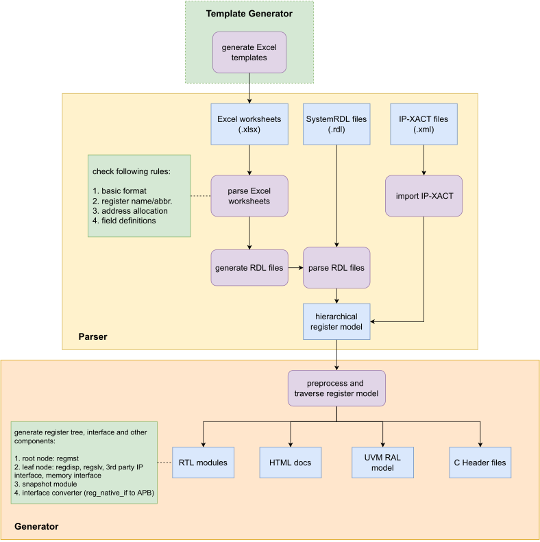
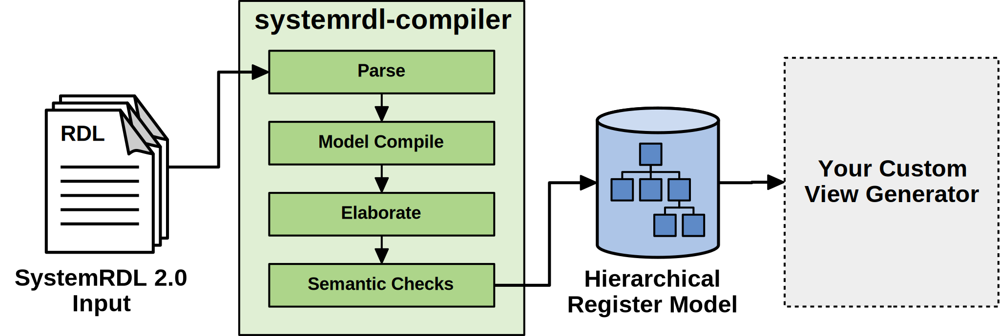
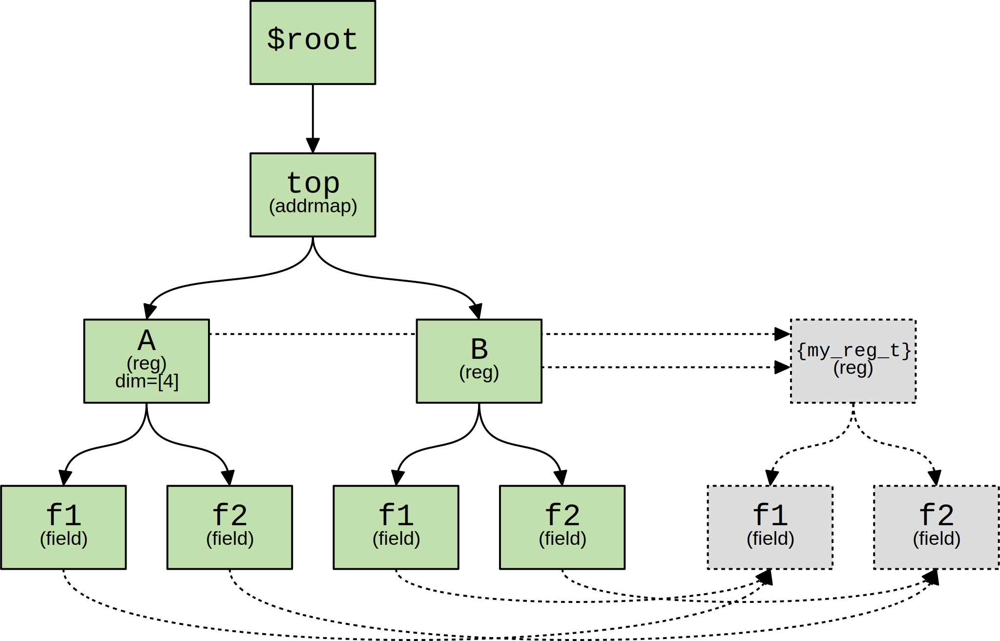
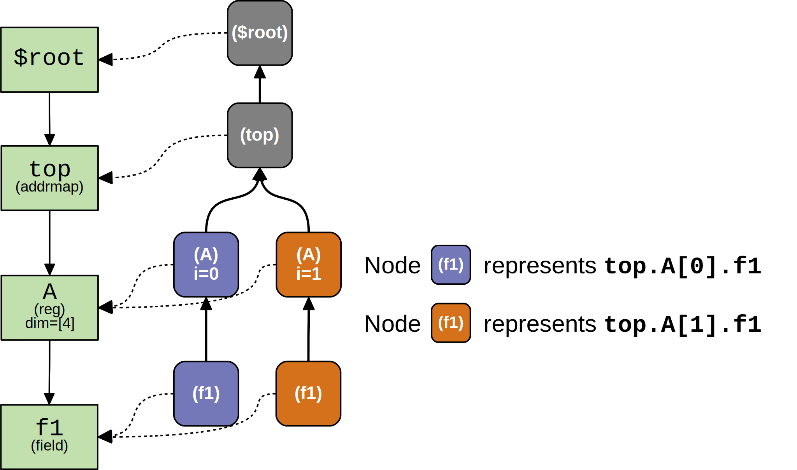

# **Content**

# **HJ-micro Register Design Automation Tool (HRDA Tool)**

## **Introduction**

HJ-micro Register design Automation (HRDA) Tool is a command-line register automation tool developed by Python, which can be divided into two major parts: front-end and back-end. The front-end comprises template generation which supports for generating register description templates in Excel worksheet (.xlsx) format, and Parser which can parse the **input Excel Worksheet or SystemRDL (.rdl) descriptions** with semantic and predefined rule check. The back-end comprises generator abilities supporting for generating register RTL (Verilog/SystemVerilog) Modules, HTML documents, UVM RAL models and C header files.

For modules with few registers and simple address mapping, Excel worksheet is recommended. For some complicated modules with a large amount of registers and fancy mappings, SystemRDL is more expressive and flexible.

The overall tool flow is shown as the figure below.

<span id="pics_tool_flow"></span>


### **Register Template Generator**

### **Excel Parser**

The Excel parser check all Excel files provided by the designer, including basic format and design rules, and then converts the parsed register specification model into SystemRDL code, which will be submitted to the `SystemRDL Compiler` later. Intermediate SystemRDL code generation also allows the designer to add more complicated features supported by SystemRDL.

To learn what rules are checked, see [Excel Worksheet Guideline](#excel-worksheet-guideline). If any of rules are violated, Excel parser will raise error and error message will display the position where error occurs.

### **SystemRDL Parser/Compiler**

SystemRDL parser relies on an open-source project `SystemRDL Compiler`, see the link in section 3.1 for detailed information. SystemRDL Compiler is able to parse, compile and check RDL input files followed by SystemRDL 2.0 Spec to generate a traversable hierarchical register model, with the basic workflow shown in the following diagram.



Simple example:

```systemrdl
reg my_reg_t {
    field {} f1;
    field {} f2;
};

addrmap top {
    my_reg_t A[4];
    my_reg_t B;
};
```

Once compiled, the register model can be described like this:



or another `Node` overlay:



The model bridges the front-end and the back-end of this tool. The front-end parser ultimately generates this model, and everything on the back-end is based on this model as input.

For a detailed description of this model, see SystemRDL Compiler Documentation : [https://systemrdl-compiler.readthedocs.io/en/stable/index.html](https://systemrdl-compiler.readthedocs.io/en/stable/index.html)

### **RTL Generator**

The RTL Generator is the core functionality of HRDA. It traverses the hierarchical register model and generate corresponding RTL modules.

For detailed RTL architecture information, see [RTL Architecture](#rtl-architecture).

### **HTML Generator**

The HTML generator relies on the open-source project `PeakRDL-html`, see the link in [Environment and Dependencies](#environment-and-dependencies) for detailed information. A simple example of exported HTML is shown below.


### **UVM RAL Generator**

The export of the UVM register model relies on the open-source project `PeakRDL-uvm`, see the link in section 3.1 for detailed information.

### **C Header Generator (TBD)**

## **RTL Architecture**

Control/Status regsiters are distributed all around the chip in different subsystems, such as PCIe, MMU, SoC interconnect, Generic Interrupt Controller, etc. Not only hardware logic inside the respective subsystem, but also software needs to access them via system bus. HRDA provides a unified RTL architecture to make all these registers accessible by software, or visible to processors, thus all modules forms a network.

### **Register Network**

Register Network, or `reg_network`, is a multi-root hierarchical network. A typical network is shown below.

<span id="pics_reg_network"></span>


The entire network consists of many `reg_tree` modules generated by HRDA which may connect to upper `ARM NIC-450 Non-coherent Interconnect`. Register Access Master, or `regmst`, is the root of a `reg_tree`. It translate `APB` transactions to register native access interface, or `reg_native_if`, defined in HRDA. Designers can delicately construct multiple SystemRDL descriptions to get multiple `reg_tree` to form a larger network and support concurrent register access.

There may be some submodules in `reg_tree`:

- Register Access Master (`regmst`): a module generated by HRDA that serves as the root node of `regmst`. It is responsible for transaction dispatch and monitoring leaf nodes' status, see detailed information in [Register Access Master (regmst)](#register-access-master-regmst).

- Register Access Slave (`regslv`): a module generated by HRDA that contains all **internal** registers described in SystemRDL. `regslv` can be chained to serve as a leaf node in hierarchical `reg_tree`. If a bunch of registers are declared to be **external**, `regslv` will not be generated. See detailed information in [Register Access Slave (regslv)](#register-access-slave-regslv) and [SystemRDL Coding Guideline](#systemrdl-coding-guideline).

- Other IPs: registers in other 3rd party IPs can also be accessed by connecting themselves to `reg_tree` via `reg_native_if`.

- Memory: external memories can be mapped to the register address space and integrated into the unified management of `reg_network`, at which point the system bus sees no difference in the behavior of memory accesses and register accesses.

--------------------

**Note:** `reg_network` is not the RTL code generation boundry of HRDA. In other words, there is not a wrapper of `reg_network`. It all depends on designers how to connect `reg_tree` (`regmst` and `regslv`) to the upper interconnect unit like `NIC-450`.

--------------------

### **Register Native Access Interface (reg_native_if)**

Typically, expect for the upper interface of `regmst`, every module with registers is connected into the register network as a leaf node in `reg_tree` via `reg_native_if`.  `reg_natvie_if` is used under following circumstances in `reg_network`:

- `regmst/regslv <-> regslv`

- `regmst/regslv <-> other IPs`

- `regmst/regslv <-> external memories`

#### **write transaction**

#### **read transaction**

### **Register Access Master (regmst)**

### **Register Access Slave (regslv)**

<span id="pics_field_rtl_infra"></span>


The general architecture of `regslv` is shown above. **Every `addrmap` in SystemRDL or a worksheet in Excel corresponds to a generated `regslv` module**, and the RTL module name (and Verilog/SystemVerilog filename) is `regslv_xxx`, where `xxx` is the `addrmap` instance name in SystemRDL or Excel worksheet filename.

Each `regslv` module has its own registers based on the design description. `regslv` can also forward access interface (`reg_native__if`) to downstream `regslv` modules if there are nested `addrmap` instances in SystemRDL, and to memory instances (usually memory wrappers), or other 3rd party IPs. Therefore, for external memories and other 3rd party IPs, designers are obliged to implement interface translation logic (a bridge) between `reg_native_if` and memory/IP access interfaces.

#### **slv_fsm**

`slv_fsm` handles transactions at the input `reg_native_if` from upstream `regslv` or `regmst` modules and forwards transactions to external `reg_native_if` in case that the access is located at downstream modules. The state transition diagram is shown below.

#### **external_decoder**

```verilog
always_comb begin
    int_selected = 1'b0;
    ext_sel = {EXT_NUM{1'b0}};
    none_selected = 1'b0;
    unique casez (global_address)
        64'h0,64'h4: int_selected = 1'b1;   //
        64'h2?,64'h3?: ext_sel[0] = 1'b1;   // external module ext_mem_1
        default: none_selected = 1'b1;
    endcase
end
```

#### **internal_decoder**

```verilog
always_comb begin
    reg_sel = {REG_NUM{1'b0}};
    dummy_reg = 1'b0;
    unique casez (regfile_addr)
        64'h0:reg_sel[0] = 1'b1;//['REG1', '_snap_0']
        64'h4:reg_sel[1] = 1'b1;//['REG1', '_snap_1']
        default: dummy_reg = 1'b1;
    endcase
end
```

#### **split_mux (internal_mux, external_mux, ultimate_mux)**

`split_mux` is a one-hot multiplexor with a parameter to specify `group size`. When number of input candidcates exceed `group size`, a two-level multiplexor network is constructed and D flip-flops are inserted between the first and second level to improve timing.

#### **snapshot register/memory entry**

#### **clock domain crossing (CDC) solution**

### **Register and Field**

`field` is the structure component at the lowest level. The `field` architecture is shown below.

<span id="pics_field_rtl_infra"></span>


The `field` module implements various hardware and
software access types defined in Excel worksheets and SystemRDL descriptions. When alias or shared property is defined in SystemRDL, a corresponding number of software control (`sw_ctrl`) logic will be generated.

All supported access types are listed in `xregister.vh`:

```verilog
// SW_TYPE
`define SW_RO    4'd0 // Read only
`define SW_RW    4'd1 // Read Write
`define SW_RW1   4'd2 // Read, Write once after reset
`define SW_WO    4'd3 // Write only
`define SW_W1    4'd4 // Write once after reset

// SW_ONREAD_TYPE
`define NA       4'd0 // No Read side-effect
`define RCLR     4'd1 // Clear on Read
`define RSET     4'd2 // Set on Read

// SW_ONWRITE_TYPE
`define NA       4'd0 // No Write side-effect
`define WOCLR    4'd1 // Write 1 to Clear
`define WOSET    4'd2 // Write 1 to Set
`define WOT      4'd3 // Write 1 to Toggle
`define WZS      4'd4 // Write 0 to Set
`define WZC      4'd5 // Write 0 to Clear
`define WZT      4'd6 // Write 0 to Toggle

// HW_TYPE
`define HW_RO    4'd0 // Read only
`define HW_RW    4'd1 // Read, Write on hw_pulse
`define HW_CLR   4'd2 // Bitwise Clear, hw_pulse input is ignored.
`define HW_SET   4'd3 // Bitwise Set, hw_pulse input is ignored.
```

Additionally, there are some other features that can be implemented and generated in RTL. See more in [SystemRDL Coding Guideline](#systemrdl-coding-guideline).

`field` is concatenated to form `register` and mapped into address space for software access, as shown below.

### **Performance Evaluation**

## **SystemRDL Coding Guideline**

SystemRDL is a language for the design and delivery of intellectual property (IP) products used in designs. SystemRDL semantics supports the entire life-cycle of registers from specification, model generation, and design verification to maintenance and documentation. Registers are not just limited to traditional configuration registers, but can also refer to register arrays and memories.

This chapter is based on the [SystemRDL 2.0 Specification](https://www.accellera.org/images/downloads/standards/systemrdl/SystemRDL_2.0_Jan2018.pdf). In other words, it specifies a subset of SystemRDL syntax and features to use, and some pre-defined properties under this framework. What's more significant, **HRDA Tool only interpret SystemRDL features mentioned in this chapter, namely other features are not supported and make no sense in the tool back-end generation process**.

### **General Rules**

#### **Components**

A component in SystemRDL is the basic building block or a container which contains properties that further describe the component’s behavior. There are several structural components in SystemRDL: `field`, `reg`, `mem`, `regfile`, and `addrmap`. All structural components are supported in HRDA Tool, and their mappings to RTL module are as follows:

- `field`: describes fields in registers

- `reg`: describes registers that contains many fields

- `regfile`: pack registers together with support of address allocation

- `addrmap`: similar to `regfile` on packing register and allocating addresses.
   Additionally, it defines the **RTL code generation boundary**. Each definition of `addrmap` with `hj_genrtl` property set to `True` will be generated to an `regslv` module, see Chapter

Additionally, HRDA does not support non-structural components, such as `signal`. But signals are indeed used to describe field synchronous resets in a special way: defining a user-defined property, see Chapter

### **Correspondence to RTL**

(TBD)

## **Excel Worksheet Guideline**

### **Table Format**

An example Excel worksheet that describes only one register is shown below, in two language (cn/en) versions.


Designers can refer to this template generated by Template Generator, and edit to extend it, like arrange several tables corresponding to more than one registers in the worksheet in a way that a few blank lines separate each table.

Register elements are as follows.

- Register Name: consistent with the `name` attribute in SystemRDL. It is used to help understand register functionality which will be shown on HTML documents.

- Address Offset: each Excel worksheet is mapped to an `addrmap` component in SystemRDL and has a independent base address. Therefore, the address offset value filled in by the designer is based on the current worksheet's base address. It is recommended to start addressing from `0X0`.

- Register Bitwidth: currently only `32 bit` or `64 bit` is supported. If 32-bit bus interface is used to connected to the whole system, the snapshot feature will be implemented in 64-bit registers.

- Register Abbreviation: consistent with the register instance name in SystemRDL and in RTL modules.

- Register Description: consistent with the `desc` attribute in the SystemRDL. It is used to help understand register functionality which will be shown on HTML documents.

- Fields: define all fields including `Reserved`, listed in lines one by one.

  - Bit Range: indicates the location of the field in the form of `xx:xx`.

  - Field Name: corresponds to the field instance name of the generated RTL, also consistent with the `name` attribute in SystemRDL.

  - Field Description: consistent with the `desc` attribute in SystemRDL.

  - Read Attribute (Read Type): consistent with the `onread` attribute in SystemRDL. `R`, `RCLR` and `RSET` are supported.

  - Write Attribute (Write Type): consistent with the `onwrite` attribute in SystemRDL. `W`, `WOC`, `WOS`, `WOT`, `WZC`, `WZS`, `WZT` are supported.

  - Reset value: field reset value for synchronous and generic asynchronous reset signals.

  - Synchronous Reset Signals: In addition to the generic asynchronous reset by default, declaration of independent, one or more synchronous reset signals are supported.

Degisners should keep items mentioned above complete.

### **Rules**

Follows are rules that designers should not violate when editing Excel worksheets.

- **BASIC_FORMAT :** Basic format constrained by regular expressions.

  1. the base address must be hexdecimal and prefixed with `0X(x)`

  2. the address offset must be hexdecimal and prefixed with `0X(x)`

  3. the register bitwidth can only be `32 bit` or `64 bit`.

  4. supported field read and write attributes: `R`, `RCLR`, `RSET`, `W`, `WOC`, `WOS`, `WOT`, `WZC`, `WZS`, `WZT`

  5. field bit range is in `xx:xx` format

  6. the reset value is hexdecimal and prefixed with `0X(x)`

  7. field synchronous reset signals is `None` if there is none, or there can be one or more, separated by `,` in the case of more than one

- **REG_ADDR :** Legality of the assignment of register address offsets.

  1. address offset is by integral times of the register byte length (called `regalign` method in SystemRDL)

  2. no address overlap is allowed in the same Excel worksheet

- **FIELD_DEFINITION :** Legality of field definitions.

  1. the bit order of multiple fields should be arranged from high to low

  2. the bit range of each field should be arranged in `[high_bit]:[low_bit]` order

  3. field bit range no overlap (3.1), and no omission (3.2)

  4. the reset value cannot exceed the maximum value which field can represent

  5. no duplicate field name except for `Reserved`

  6. the synchronous reset signal of the `Reserved` field should be `None`.

  7. no duplicate synchronous reset signal name in one field.

## **Tool Flow Guideline**

### **Environment and dependencies**

- Available OS: Windows/Linux

- Python Version 3.7+

  - systemrdl-compiler: [https://github.com/SystemRDL/systemrdl-compiler](https://github.com/SystemRDL/systemrdl-compiler)

  - PeakRDL-html: [https://github.com/SystemRDL/PeakRDL-html](https://github.com/SystemRDL/PeakRDL-html)

  - PeakRDL-uvm: [https://github.com/SystemRDL/PeakRDL-uvm](https://github.com/SystemRDL/PeakRDL-uvm)

### **Command options and arguments**

- `-h,--help`

  Show help information.

- `-v, --version`

  Show `RDA Tool` version.

- `excel_template`

  Subcommand to generate register specification templates in Excel worksheet (.xlsx) format with the following command options.

  `-h, --help`

  Show help information for this subcommand.

  `-d,--dir [DIR]`

  Specify the location of the directory where the template will be generated, the default is the current directory.

  `-n,--name [NAME]`

  Specify the file name of the generated template, if there is a duplicate name, it will be automatically distinguished by a number, the default is `template.xlsx`.

  `-rnum [RNUM]`

  Specify the number of registers to be included in the generated template, default is `1`.

  `-rname [TEM1 TEM2 ...]`

  Specify the name of the register in the generated template, the default is `TEM`, the default name and abbreviation are the same.

  `-l, --language [cn | en]`

  Specify the language format of the generated template: `cn/en`, default is `cn`.

- `parse`

  Sub-command to check the syntax and rules of the input Excel(.xlsx) and SystemRDL(.rdl) files, and compile them into the hierarchical model defined in `systemrdl-compiler`, with the following command options.

  `-h, --help`

  Show help information for this subcommand.

  `-f, --file [FILE1 FILE2 ...]`

  Specify the input Excel(.xlsx)/SystemRDL(.rdl) files, support multiple, mixed input files at the same time, error will be reported if any of input files do not exist.

  `-l, --list [LIST_FILE]`

  Specify a text-based file list including all files to be read. Parser will read and parse files in order, if the file list or any file in it does not exist, an error will be reported.

  Note that `-f, --file` or `-l, --list` options must be used but not at the same time. If so, warning message will be reported and parser will ignore the `-l, --list` option.

  `-g, --generate`

  Explicitly specifying this option parses and converts all input Excel (.xlsx) files to SystemRDL (.rdl) files one by one, with separate `addrmap` for each Excel worksheet. When the input is all Excel (.xlsx) files, parser generates an additional SystemRDL (.rdl) file containing the top-level `addrmap`, which instantiates all child `addrmaps`.

  If this option is not used, Parser will only conduct rule check and parse, thus no additional files will be generated.

  `-m, --module [MODULE_NAME]`

  If `-g, --generate` option is specified, this option specifies top-level `addrmap` name and top-level RDL file name to be generated for subsequent analysis and further modification. See detailed information in Chapter 2.4: RTL generator.

  `-gdir, --gen_dir [GEN_DIR]`

  When using the `-g, --generate` option, this option specifies the directory where the files are generated, the default is the current directory.

- `generate`

  subcommand for generating RTL Module, HTML Docs, UVM RAL, C Header Files, with the following command options.

  `-h, --help`

  Show help information for this subcommand.

  `-f, --file [FILE1 FILE2 ...]`

  Specify the input Excel(.xlsx)/SystemRDL(.rdl) files, support multiple, mixed input files at the same time, error will be reported if any of input files do not exist.

  `-l, --list [LIST_FILE]`

  Specify a text-based file list including all files to be read. Parser will read and parse files in order, if the file list or any file in it does not exist, an error will be reported.

  Note that `-f, --file` or `-l, --list` options must be used but not at the same time. If so, warning message will be reported and parser will ignore the `-l, --list` option.

  `-m, --module [MODULE_NAME]`

  Used for the situation where all input files are Excel worksheets. Like `-m` option in `parse` sub-command, this option specifies top-level `addrmap` name and top-level RDL file name to be generated for subsequent analysis and further modification. See detailed information in Chapter 2.4: RTL generator.

  `-gdir, --gen_dir [dir]`

  Specify the directory where the generated files will be stored. If the directory does not exist, an error will be reported. Default is the current directory.

  `-grtl, --gen_rtl`

  Specify this option explicitly to generate RTL Module code.

  `-ghtml, --gen_html`

  Specify this option explicitly to generate the register description in HTML format.

  `-gral, --gen_ral`

  Specify this option explicitly to generate the UVM RAL verification model.

  `-gch,--gen_cheader`

  Specifying this option explicitly generates the register C header file.

  `-gall,--gen_all`

  Specifying this option explicitly generates all of the above files.

### **Examples**

Before trying all below examples, please ensure that you can execute `hrda` command. If execution of `hrda` fails, first check that `hrda` is in `PATH`, if not, try one of following possible solutions:

- switch to the source directory of the tool
- add the executable `hrda` to `PATH`
- use `module` tool and `module load` command for configuration.

If you can execute `hrda` successfully, it is recommanded to use `hrda -h`, `hrda excel_template -h`, `hrda parse -h`, `hrda generate -h` to get command/sub-command information. Then you can try following examples:

- Generate the register template in Excel format.

  ```bash
  mkdir test
  hrda excel_template -n test.xlsx -rnum 3 -rname tem1 tem2 tem3
  ```

- Parse the register description in Excel format and generate the corresponding RDL file.

  ```bash
  hrda parse -f test/test.xlsx -g -gdir . /test -m test_top
  # another method: edit and save a list file
  hrda parse -l test.list -g -gdir . /test -m test_top
  ```

- Generate RTL modules, HTML docs, UVM RAL and C header files

  ```bash
  hrda generate -f test.xlsx -gdir . /test -grtl -ghtml -gral -gch
  # another method: edit and save a list file
  hrda generate -l test.list -gdir . /test -gall
  ```

## **Miscellaneous**
