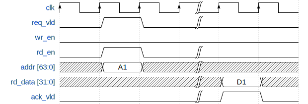
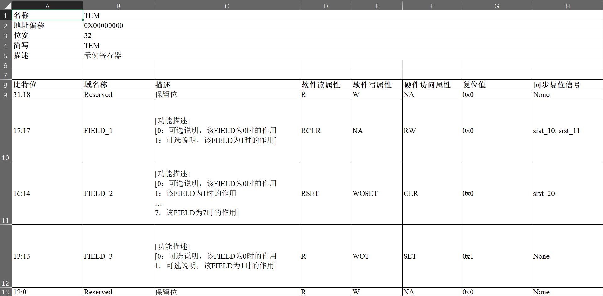

# **HJ-micro Register Design Automation Tool (HRDA Tool)**

## **Revision History**

| Date       | Revision | Description                               |
| ---------- | -------- | ----------------------------------------- |
| 2022-03-22 | 0.1      | Add regmst for deadlock detection.        |
| 2022-05-12 | 0.2      | Support IP-XACT integration in SystemRDL. |

## **1. Introduction**

HJ-micro Register design Automation (HRDA) Tool is a command-line register automation tool developed by Python, which can be divided into two major parts: front-end and back-end. The front-end comprises template generation which supports for generating register description templates in Excel worksheet (.xlsx) format, and Parser which can parse the **input Excel Worksheet or SystemRDL (.rdl) descriptions** with semantic and predefined rule check. The back-end comprises generator abilities supporting for generating register RTL (Verilog/SystemVerilog) Modules, HTML documents, UVM RAL models and C header files.

For modules with few registers and simple address mapping, Excel worksheet is recommended. For some complicated modules with a large amount of registers and fancy mappings, SystemRDL is more expressive and flexible.

The overall tool flow is shown in [Figure 1.1](#pics_tool_flow).

<span id="pics_tool_flow"></span>

<center>
    <div style="display: inline-block;
    color: #999;
    padding: 2px;">Figure 1.1 Register Design Automation (HRDA) tool flow </div>
</center>

### **Register Template Generator**

The template generator provide convenience for designers who edit Excel worksheets. It generates several template tables including basic register definitions such as name, width, address offset, field definitions, etc., in one worksheet. Designers can refer to these templates and revise them to meet their own specifications.

See [Figure ](#) and [Excel Worksheet Guideline](#excel-worksheet-guideline) for detailed information.

### **Excel Parser**

The Excel parser check all Excel files provided by the designer, including basic format and design rules, and then converts the parsed register specification model into SystemRDL code, which will be submitted to the `SystemRDL Compiler` later. Intermediate SystemRDL code generation also allows the designer to add more complicated features supported by SystemRDL.

To learn what rules are checked, see [Excel Worksheet Guideline](#excel-worksheet-guideline). If any of rules are violated, Excel parser will raise error and error message will display the position where error occurs.

### **SystemRDL Parser/Compiler**

SystemRDL parser relies on an open-source project `SystemRDL Compiler`, see the link in [Environment and Dependencies](#environment-and-dependencies) for detailed information. SystemRDL Compiler is able to parse, compile, elaborate and check RDL input files followed by [SystemRDL 2.0 Specification](https://www.accellera.org/images/downloads/standards/systemrdl/SystemRDL_2.0_Jan2018.pdf) to generate a traversable hierarchical register model as a class object in Python. Its basic workflow is shown in [Figure ](#pics_systemrdl_compiler).

<span id="pics_systemrdl_compiler"></span>

<center>
    <div style="display: inline-block;
    color: #999;
    padding: 5px;">Figure 1.2 SystemRDL compiler workflow </div>
</center>

Simple example:

```systemrdl
reg my_reg_t {
    field {} f1;
    field {} f2;
};

addrmap top {
    my_reg_t A[4];
    my_reg_t B;
};
```

Once compiled, the register model can be described like this:


The model bridges the front-end and the back-end of this tool. The front-end parser ultimately generates this model, and everything on the back-end is based on this model as input.

For a detailed description of this model, see SystemRDL Compiler Documentation : <https://systemrdl-compiler.readthedocs.io/en/stable/index.html>

### **RTL Generator**

The RTL Generator is the core functionality of HRDA. It traverses the hierarchical register model and generate corresponding RTL modules.

For detailed RTL architecture information, see [RTL Architecture](#rtl-architecture).

### **HTML Generator**

The HTML generator relies on an open-source project `PeakRDL-html`, see the link in [Environment and Dependencies](#environment-and-dependencies) for detailed information. A simple example of exported HTML is shown below.


### **UVM RAL Generator**

The export of the UVM register model relies on an open-source project `PeakRDL-uvm`, see the link in [Environment and Dependencies](#environment-and-dependencies) for detailed information.

### **C Header Generator (TBD)**

## **2. RTL Architecture**

Control/Status regsiters are distributed all around the chip in different subsystems, such as PCIe, MMU, SoC interconnect, Generic Interrupt Controller, etc. Not only hardware logic inside the respective subsystem, but also software needs to access them via system bus. HRDA provides a unified RTL architecture to make all these registers accessible by software, or visible to processors, thus all modules forms a network.

### **Register Network**

Register Network, or `reg_network`, is a multi-root hierarchical network. A typical network is shown in [Figure ](#pics_reg_network).

<span id="pics_reg_network"></span>

<center>
    <div style="display: inline-block;
    color: #999;
    padding: 5px;">Figure 2.1 register network</div>
</center>

The entire network consists of many `reg_tree` modules generated by HRDA which may connect to upper `ARM NIC-450 Non-coherent Interconnect`. Register Access Master, or `regmst`, is the root of a `reg_tree`. It translates `APB` transactions to register native access interface, or `reg_native_if`, defined in HRDA. Designers can delicately construct multiple SystemRDL descriptions to get multiple `reg_tree` to form a larger network and support concurrent register access.

There are some submodules in `reg_tree`:

- Register Access Master (`regmst`): a module generated by HRDA that serves as the root node of `regmst`. It is responsible for transaction dispatch and monitoring leaf nodes' status, see detailed information in [Register Access Master (regmst)](#register-access-master-regmst).

- Register Access Slave (`regslv`): a module generated by HRDA that contains all **internal** registers described in SystemRDL. `regslv` can be chained to serve as a leaf node in hierarchical `reg_tree`. If some registers are declared to be **external** in SystemRDL, `regslv` will not be generated. See detailed information in [Register Access Slave (regslv)](#register-access-slave-regslv).

- Other IPs: registers in other 3rd party IPs can also be accessed by connecting themselves to `reg_tree` via `reg_native_if`. `reg_native_if` can be forwarded by `regmst` or any `regslv` nodes.

- Memory: external memories can be mapped to the register address space and integrated into the unified management of `reg_network` via `reg_native_if`, at which point the system bus sees no difference in the behavior of memory accesses and register accesses.

All modules above is corresponding to some components defined in the SystemRDL description written the designer. See detailed information in [SystemRDL Coding Guideline](#systemrdl-coding-guideline).

--------------------

**Note:** `reg_network` is not the RTL code generation boundry of HRDA. In other words, there is not a wrapper of `reg_network`. Only separate `regmst` and `regslv` modules will be generated as RTL modules, so it all depends on designers how to connect `reg_tree` (`regmst` and `regslv`) to the upper interconnect unit like `NIC-450`.

--------------------

### **Register Native Access Interface (reg_native_if)**

Typically, except that the upper interface of `regmst` is `APB`, every module with registers is connected into the register network as a leaf node in `reg_tree` via `reg_native_if`.  `reg_natvie_if` is used under following circumstances in `reg_network`:

- `regmst/regslv <-> regslv`

- `regmst/regslv <-> other IPs`

- `regmst/regslv <-> external memories`

Signals of reg_natvie_if are listed in [Table ](#table_rni_def):

<span id="table_rni_def"></span>
| Signal Name | Direction | Width | Description |
| ----------- | --------- | ----- | ----------- |
| req_vld | input from upstream, output to downsream | 1 | request valid |
| ack_vld | output to upstream, input from downsream | 1 | acknowledgement valid |
| addr | input from upstream, output to downsream | BUS_ADDR_WIDTH | address |
| wr_en | input from upstream, output to downsream | 1 | write enable |
| rd_en | input from upstream, output to downsream | 1 | read enable |
| wr_data | input from upstream, output to downsream | BUS_DATA_WIDTH | address |
| rd_data | output to upstream, input from downsream | BUS_DATA_WIDTH | address |

where `BUS_ADDR_WIDTH` defaults to 64 bit, and `BUS_DATA_WIDTH` defaults to 32 bit.

As mentioned before, `reg_native_if` can be forwarded to connect memories or 3rd party IPs which serve as slave. The next [Write Transaction](#write-transaction) and [Read Transaction](#read-transaction) section shows basic requirements.

#### **Write Transaction**

There are two methods for write transactions, one is with no wait state (`ack_vld` is asserted once slave detects `req_vld` and `wr_en` raises), the other is with one or more wait states (`ack_vld` is asserted after `req_vld` and `wr_en` have raised for more than one cycles). Address and write data should be valid once `req_vld` and `wr_en` are asserted.

<span id="pics_rni_write_trans_1"></span>

<div style="display: inline-block;
color: #999;
padding: 5px;">Figure 2.x write transaction with no wait state</div>

<span id="pics_rni_write_trans_2"></span>

<div style="display: inline-block;
color: #999;
padding: 5px;">Figure 2.x write transaction with one or more wait states</div>

#### **Read Transaction**

There are two methods for read transactions, one is with no wait state (`ack_vld` is asserted once slave detects `req_vld` and `rd_en` raises), the other is with one or more wait states (`ack_vld` is asserted after `req_vld` and `rd_en` have raised for more than one cycles). Address should be valid once `req_vld` and `rd_en` are asserted.

<span id="pics_rni_read_trans_1"></span>

<div style="display: inline-block;
color: #999;
padding: 5px;">Figure 2.x read transaction with no wait state</div>

<span id="pics_rni_read_trans_2"></span>

<div style="display: inline-block;
color: #999;
padding: 5px;">Figure 2.x read transaction with one or more wait states</div>

### **Register Access Master (regmst)**

The top-level root `addrmap` instance in SystemRDL or a worksheet in Excel corresponds to a generated `regmst` module, and the RTL module name (and Verilog/SystemVerilog filename) is `regmst_xxx`, where `xxx` is the root `addrmap` instance name in SystemRDL or Excel worksheet filename.

`regmst` is the root node of `reg_tree`, and is responsible for monitoring all downstream nodes. [Figure ](#pics_regmst_rtl_infra) shows the architecture of `regmst`. `regmst` bridges SoC-level interconnect (APB now) and `reg_native_if`. `dispatch_decoder` decodes the target address and `mst_fsm` launches the access (read/write) request to internal registers (if exist), downstream `regslv` modules, 3rd party IPs or external memories. Then `regmst` starts a timer. If timeout event occurs in waiting for response from downstream modules, `regmst` responds to upper interconnect with fake data `0xdead1eaf`, and aseerts an interrupt to report the timeout event. At the same time, `regmst` asserts global synchronous reset signals, which is broadcasted to all `regslv` modules and resets all FSM (including some units like `snapshot`) to idle state so that `reg_tree` will not be stuck.

<span id="pics_regmst_rtl_infra"></span>

<center>
<div style="display: inline-block;
color: #999;
padding: 5px;">Figure 2.x regmst block diagram</div>
</center>

`regmst` does not support outstanding transactions. So timeout detecting logic is quite straitforward in FSM:

  1. `regmst` decodes target address to determine the output interface

  2. `regmst` starts forwarding access to the corresponding downstream modules (`regslv`, external memory, 3rd party IP), waits for response, and starts a timer.

     - If downstream modules responds with `ack_vld` asserted in `reg_native_if`, `regmst` responds to upper interconnect with `PREADY` asserted in `APB` interface, resets timer, and returns to idle state.

     - If timeout event occurs, `regmst` logs the current address, finishes the transaction with fake data to the upper interconnect, and asserts the interrupt signal.

### **Register Access Slave (regslv)**

<span id="pics_regslv_rtl_infra"></span>

<center>
<div style="display: inline-block;
color: #999;
padding: 5px;">Figure 2.x regslv block diagram</div>
</center>

The general architecture of `regslv` is shown above. Every `addrmap` instance **under the root `addrmap`** in SystemRDL or a worksheet in Excel corresponds to a generated `regslv` module, and the RTL module name (and Verilog/SystemVerilog filename) is `regslv_xxx`, where `xxx` is the `addrmap` instance name in SystemRDL or Excel worksheet filename.

Each `regslv` module has its own registers based on the design description. `regslv` can also forward access interface (`reg_native__if`) to downstream `regslv` modules if there are nested `addrmap` instances in SystemRDL, and to memory instances (usually memory wrappers), or other 3rd party IPs. Therefore, for external memories and other 3rd party IPs, designers are obliged to implement interface translation logic (a bridge) between `reg_native_if` and memory/IP access interfaces.

#### **slv_fsm**

`slv_fsm` handles transactions at the input `reg_native_if` from upstream `regslv` or `regmst` modules and forwards transactions to external `reg_native_if` in case that the access is located at downstream modules. The state transition diagram is shown in [Figure ](#).

#### **external_decoder**

```verilog
always_comb begin
    int_selected = 1'b0;
    ext_sel = {EXT_NUM{1'b0}};
    none_selected = 1'b0;
    unique casez (global_address)
        64'h0,64'h4: int_selected = 1'b1;   //
        64'h2?,64'h3?: ext_sel[0] = 1'b1;   // external module ext_mem_1
        default: none_selected = 1'b1;
    endcase
end
```

#### **internal_decoder**

```verilog
always_comb begin
    reg_sel = {REG_NUM{1'b0}};
    dummy_reg = 1'b0;
    unique casez (regfile_addr)
        64'h0:reg_sel[0] = 1'b1;//['REG1', '_snap_0']
        64'h4:reg_sel[1] = 1'b1;//['REG1', '_snap_1']
        default: dummy_reg = 1'b1;
    endcase
end
```

#### **split_mux (internal_mux, external_mux, ultimate_mux)**

`split_mux` is a one-hot multiplexor with a parameter to specify `group_size`. When number of input candidcates exceed `group_size`, a two-level multiplexor network is constructed and DFFs are inserted between two levels to improve timing performance.

#### **snapshot module**

#### **clock domain crossing (CDC) solution**

### **Register and Field**

`field` is the structure component at the lowest level. The `field` architecture is shown below.

<span id="pics_field_rtl_infra"></span>

<center>
<div style="display: inline-block;
color: #999;
padding: 5px;">Figure 2.x field block diagram</div>
</center>

The `field` module implements various hardware and
software access types defined in Excel worksheets and SystemRDL descriptions. When alias or shared property is defined in SystemRDL, a corresponding number of software control (`sw_ctrl`) logic will be generated.

All supported access types are listed in `xregister.vh`:

```verilog
// SW_TYPE
`define SW_RO    4'd0 // Read only
`define SW_RW    4'd1 // Read Write
`define SW_RW1   4'd2 // Read, Write once after reset
`define SW_WO    4'd3 // Write only
`define SW_W1    4'd4 // Write once after reset

// SW_ONREAD_TYPE
`define NA       4'd0 // No Read side-effect
`define RCLR     4'd1 // Clear on Read
`define RSET     4'd2 // Set on Read

// SW_ONWRITE_TYPE
`define NA       4'd0 // No Write side-effect
`define WOCLR    4'd1 // Write 1 to Clear
`define WOSET    4'd2 // Write 1 to Set
`define WOT      4'd3 // Write 1 to Toggle
`define WZS      4'd4 // Write 0 to Set
`define WZC      4'd5 // Write 0 to Clear
`define WZT      4'd6 // Write 0 to Toggle

// HW_TYPE
`define HW_RO    4'd0 // Read only
`define HW_RW    4'd1 // Read, Write on hw_pulse
`define HW_CLR   4'd2 // Bitwise Clear, hw_pulse input is ignored.
`define HW_SET   4'd3 // Bitwise Set, hw_pulse input is ignored.
```

Additionally, there are some other features that can be implemented and generated in RTL. See more in [SystemRDL Coding Guideline](#systemrdl-coding-guideline).

`field` is concatenated to form `register` and mapped into address space for software access, as shown in [Figure ](#).


### **Performance Evaluation**

## **3. SystemRDL Coding Guideline**

SystemRDL is a language for the design and delivery of intellectual property (IP) products used in designs. SystemRDL semantics supports the entire life-cycle of registers from specification, model generation, and design verification to maintenance and documentation. Registers are not just limited to traditional configuration registers, but can also refer to register arrays and memories.

This chapter is based on the [SystemRDL 2.0 Specification](https://www.accellera.org/images/downloads/standards/systemrdl/SystemRDL_2.0_Jan2018.pdf). In other words, it specifies a subset of SystemRDL syntax and features to use, and some pre-defined properties under this framework. What's more significant, **HRDA Tool only interpret SystemRDL features mentioned in this chapter, namely other features are not supported and make no sense in the tool back-end generation process**.

### **General Rules**

#### **Components and Definition**

A component in SystemRDL is the basic building block or a container which contains properties that further describe the component’s behavior. There are several structural components in SystemRDL: `field`, `reg`, `mem`, `regfile`, and `addrmap`. All structural components are supported in HRDA Tool, and their mappings to RTL module are as follows:

- `field`: describes fields in registers

- `reg`: describes registers that contains many fields

- `regfile`: pack registers together with support of address allocation

- `addrmap`: similar to `regfile` on packing register and allocating addresses.
   Additionally, it defines the **RTL code generation boundary**. Each definition of `addrmap` with `hj_genrtl` property set to `True` will be generated to an `regslv` module, see [Table ](#)

Additionally, HRDA supports one non-structural component, `signal`. Signals are used to describe field synchronous resets. But SystemRDL seems to be not allowed to reference `signal` components in property assignment, but HRDA implement it by defining a user-defined property named `hj_syncresetsignal`, see [Table ](#)

SystemRDL components can be defined in two ways: definitively or anonymously.

- Definitive defines a named component type, which is instantiated in a separate statement. The definitive definition is suitable for reuse.

- Anonymous defines an unnamed component type, which is instantiated in the same statement. The anonymous definition is suitable for components that are used once.

A definitive definition of a component appears as follows.

```systemrdl
component new_component_name [#(parameter_definition [, parameter_definition]*)]
{[component_body]} [instance_element [, instance_element]*];
```

An anonymous definition (and instantiation) of a component appears as follows.

```systemrdl
component {[component_body]} instance_element [, instance_element]*;
```

More explanations:

- `component` is one of the keywords mentioned above (`field`, `reg`, `regfile`, `addrmap`, `signal`).

- For a definitively defined component, `new_component_name` is the user-specified name for the component.

- For a definitively defined component, `parameter_definition` is the user-specified parameter as defined like this:

  ```systemrdl
  parameter_type parameter_name [= parameter_value]
  ```

- For an anonymously defined component, `instance_element` is the description of the instantiation attributes, as defined like this:

  ```systemrdl
  instance_name [{[constant_expression]}* | [constant_expression : constant_expression]][addr_alloc]
  ```

- The `component_body` is comprised of zero or more of the following.

  - Default property assignments

  - Property assignments

  - Component instantiations

  - Nested component definitions

- The first instance name of an anonymous definition is also used as the component type name.

- The address allocation operators like stride (`+=`), alignment (`%`), and offset (`@`) of anonymous instances are the same as the definitive instances. See [Address Allocation Operator](#address-allocation-operator) for more information.

Components can be defined in any order, as long as each component is defined before it is instantiated. All structural components (and signals) need to be instantiated before being generated.

Here is an example for register definition, where the register `myReg` is a definitive definition, and the field `data` is an anonymous definition:

```systemrdl
reg myReg #(longint unsigned SIZE = 32, boolean SHARED = true) {
  regwidth = SIZE;
  shared = SHARED;
  field {} data[SIZE – 1];
  };
```

Component definitions can have parameters. Parameter can be overwritten during component instantiation. Here is an example:

```systemrdl
addrmap myAmap {
    myReg reg32;
    myReg reg32_arr[8];
    myReg #(.SIZE(16)) reg16;
    myReg #(.SIZE(8), .SHARED(false)) reg8;
};
```

For more details, see [SystemRDL 2.0 Specification](https://www.accellera.org/images/downloads/standards/systemrdl/SystemRDL_2.0_Jan2018.pdf) Chapter 5.1.1.

#### **Component Instantiation**

In a similar fashion to defining components, SystemRDL components can be instantiated in two ways.

- A definitively defined component is instantiated in a separate statement, as follows:

  ```systemrdl
  type_name [#(parameter_instance [, parameter_instance]*)] instance_element [, instance_element]* ;
  ```

- An anonymously defined component is instantiated in the statement that defines it. For example:

```systemrdl
// The following code fragment shows a simple scalar field component instantiation.
field {} myField; // single bit field instance named "myField"

// The following code fragment shows a simple array field component instantiation.
field {} myField[8]; // 8 bit field instance named "myField"
```

#### **Component Property**

In SystemRDL, components have various properties to determine their behavior. For built-in properties, there are general component properties and specific properties for each component type (`field`, `reg`, `addrmap`, etc.) in SystemRDL. Each property is associated with at least one data type (such as integer, boolean, string, etc). In addition to build-in properties, SystemRDL also supports for user-defined properties, and HRDA tool pre-defines some user-defined properties to assist RTL module generation process, which are concretely specified in [User-defined Property](#user-defined-property).

All general component properties supported by HRDA are described in [Table ](#), and other supported component-specific properties are discussed in following chapters.

<>

Properties can be assigned in two ways. One is at the definition time, for example:

```systemrdl
field {} outer_field ;
reg {
  default name = "default name";
  field {} f1; // assumes the name "default name" from above
  field { name = "new name";} f2; // name assignment overrides "default name"
  outer_field f3 ; // name is undefined, since outer_field is not defined in the
                   // scope of the default name
} some_reg;
```

The other way is called dynamic assignment which uses the `->` operator:

```systemrdl
reg {
  field {} f1;
  f1->name = "New name for Field 1";
  } some_reg[8];

some_reg->name = "This value is applied to all elements in the array";
some_reg[3]->name = "Only applied to the 4th item in the array of 8";
```

Dynamic assignment allows the designer to overwrite or assign properties outside component definitions, thus provides much convenience for component instantiation.

#### **Instance Address Allocation**

//FIXME
The offset of an instance within an object is always relative to its
parent object.  If an instance is not explicitly assigned an address
allocation operator (see [[id:e7170ec2-c26e-434f-b022-5397f4d331b0][Address Allocation Operator]]), the compiler
assigns the address according to the *alignment* and /addressing
mode/.  The address of an instance from the top level ~addrmap~ is
calculated by adding the instance offset and the offset of all its
parent objects.

##### **Alignment**

//FIXME
The *alignment* property defines the byte value of which the
container's instance addresses shall be a multiple. This property can
be set for ~addrmaps~ and ~regfiles~ , and its value shall be a power
of two ($2^N$).  Its value is inherited by all of the container's
non-addrmap children.  By default, instantiated objects shall be
aligned to a multiple of their width (e.g., the address of a 64-bit
register is aligned to the next 8-byte boundary).

##### **Addressing Mode**

//FIXME
*addressing* property can only be used in ~addrmap~ component.  There
are three addressing modes: ~compact~, ~realign~ (the default), and
~fullalign~.

~compact~ Specifies the components are packed tightly together while
still being aligned to the ~accesswidth~ parameter:

#+begin_src systemrdl
addrmap some_map {
    default accesswidth=32;
    addressing=compact;
    reg { field {} a; } a; // Address 0x0 - 0x3: 4 bytes
    reg { regwidth=64; field {} a; } b; // Address 0x4 - 0x7: lower 32-bit,
                                        // Address 0x8 - 0xB: higher 32-bit
                                        // starting address 0x4 tightly follows previous
                                        // reg "a"
    reg { field {} a; } c[20]; // Address 0xC  - 0xF:  Element 0
                               // Address 0x10 - 0x13: Element 1
                               // Address 0x14 - 0x17: Element 2
};


addrmap some_map {
    default accesswidth=64;
    addressing=compact;
    reg { field {} a; } a; // Address 0x0 - 0x3: 4 bytes
    reg { regwidth=64; field {} a; } b; // Address 0x8 - 0xB:
    reg { field {} a; } c[20]; // Address 0x10 - Element 0
                               // Address 0x14 - Element 1
                               // Address 0x18 - Element 2
                               // starting address is 0x10, align to 64-bit, 4 bytes in 0xC-0xF is skipped
};
#+end_src

~regalign~ Specifies the components are packed so each component's
start address is a multiple of its size (in bytes).  Array elements
are aligned according to the individual element's size (this results
in no gaps between the array elements).  This generally results in
simpler address decode logic.

#+begin_src systemrdl
addrmap some_map {
  default accesswidth = 32;
  addressing = regalign;
  reg { field {} a; } a; // Address 0x0
  reg { regwidth=64; field {} a; } b; // Address 0x8-0xF, align to 64-bit
  reg { field {} a; } c[20]; // Address 0x10
                             // Address 0x14 - Element 1
                             // Address 0x18 - Element 2
};
#+end_src


~fullalign~ The assigning of addresses is similar ~regalign~, except
for arrays.  The alignment value for the first element in an array is
the size in bytes of the *whole array* (i.e., the size of an array
element multiplied by the number of elements), *rounded up to nearest
power of two*.  The second and subsequent elements are aligned
according to their individual size (so there are no gaps between the
array elements).

#+begin_src systemrdl
addrmap some_map {
  default accesswidth = 32;
  addressing = fullalign;
  reg { field {} a; } a; // Address 0
  reg { regwidth=64; field {} a; } b; // Address 8
  reg { field {} a; } c[20]; // Address 0x80 - Element 0
                             // Address 0x84 - Element 1
                             // Address 0x88 - Element 2
                             // starting address align to 4*20=80Byte,
};
#+end_src

##### **Address Allocation Operator**

//FIXME
When instantiating ~reg~, ~regfile~, ~mem~, or ~addrmap~, the address
may be assigned using one of following address allocation operators

1. ~@~: It specifies the address for the instance.
   #+begin_src systemrdl
addrmap top {
  regfile example{
    reg some_reg {
      field {} a;
      };

    some_reg a @0x0;
    some_reg b @0x4;

    // Implies address of 8
    // Address 0xC is not implemented or specified
    some_reg c;

    some_reg d @0x10;
    };
  };
   #+end_src

2. ~+=~: It specifies the address stride when instantiaing an array of
   components (controls the spacing of the components).  The address
   stride is relative to the previous instane's address.  It is only
   used for arrayed ~addrmap~, ~regfile~, ~reg~, or ~mem~.
   #+begin_src systemrdl
addrmap top {
  regfile example {
    reg some_reg { field {} a; };

    some_reg a[10]; // So these will consume 40 bytes
                    // Address 0,4,8,C....

    some_reg b[10] @0x100 += 0x10; // These consume 160-12 bytes of space
                                   // Address 0x100 to 0x103, 0x110 to 0x113,....
    };
  };
   #+end_src

3. ~%=~: It specifies the aligment of address when instantiaing a
   component (controls the aligment of the components).  The initial
   address alignment is relative to the previous instance's address.
   The ~@~ and ~%=~ operators are mutually exclusive per instance.
   #+begin_src systemrdl
addrmap top {
  regfile example {
    reg some_reg { field {} a; };

    some_reg a[10]; // So these will consume 40 bytes
                    // Address 0,4,8,C....

    some_reg b[10] @0x100 += 0x10; // These consume 160-12 bytes of space
                                   // Address 0x100 to 0x103, 0x110 to 0x113,....

    some_reg c %=0x80; // This means ((address % 0x80) == 0))
                       // So this would imply an address of 0x200 since
                       // that is the first address satisfying address>=0x194
                       // and ((address % 0x80) == 0)
  };
};
   #+end_src

### **Signal Component**

`signal` components only support `signalwidth` property, and all signals are treated and used as synchronous reset of `field` components, thus the user-defined property `hj_syncresetsignal` can be only assigned in `field` components.

### **Field Component**

#### **Naming Convention**

Each SystemRDL `field` instance will be generated to an RTL `field` module instance. In generated RTL, stem name of field is `<reg_inst_name>__<field_inst_name>`. Other signals belong to the field are named by prefixing/suffixing elements.  e.g., Register instance name is `ring_cfg`, Field instance name is `rd_ptr`:

1. `field` instance name is `x__<stem>` (prefixed with `x__`): `x__ring_cfg__rd_ptr`

2. output port name for current field value is `<stem>__curr_value`: `ring_cfg__rd_ptr__curr_value`

3. input port for update its value from hardware is `<stem>__next_value`: `ring_cfg__rd_ptr__next_value`

4. input port for quarlifying update is `<stem>__pulse`: `ring_cfg__rd_ptr__pulse`

#### **Description Guideline**

//FIXME
SystemRDL defines several properties for describing Field, however,
only a subset of them are interpreted by the scripts.  Only properties
documented in this section are allowed for Field description, others
are prohibited to use.

#+ATTR_LATEX: :environment longtable  :align |l|p{.55\textwidth}|c|c|c|
#+caption: Field Properties Supported in scripts  \label{tab:field_prop}
|-------------------+-----------------------------------------------------------------------------------------------------------------------------------+--------------------+---------+---------|
| Property          | Notes                                                                                                                             | Type               | Default | Dynamic |
|                   | <40>                                                                                                                              |                    |         |         |
|-------------------+-----------------------------------------------------------------------------------------------------------------------------------+--------------------+---------+---------|
| *fieldwidth*      | Width of Field.                                                                                                                   | /longint unsighed/ | 1       | No      |
| *reset*           | Reset value of Field.                                                                                                             | /bit/              | 0       | Yes     |
| *resetsignal*     | Reference to signal used as *Asynchornous reset* of the Field.                                                                    | /reference/        |         | Yes     |
| *hj_syncresetsignal* | Reference to signal used as *Synchronous Reset* of the Field.                                                                     | /reference/        |         | Yes     |
| *name*            | Specifies a more descriptive name (for documentation purposes).                                                                   | /string/           | ""      | Yes     |
| *desc*            | Describes the component's purpose.  MarkDown syntax is allowed                                                                    | /string/           | ""      | Yes     |
| *sw*              | Software access type, one of ~rw~, ~r~, ~w~, ~rw1~, ~w1~, or ~na~.                                                                | /access type/      | ~rw~    | Yes     |
| *onread*          | Software read side effect, one of ~rclr~, ~rset~, or ~na~.                                                                        | /onreadtype/       | ~na~    | Yes     |
| *onwrite*         | Software write side effect, one of ~woset~, ~woclr~, ~wot~, ~wzs~, ~wzc~, ~wzt~, or ~na~.                                         | /onwritetype/      | ~na~    | Yes     |
| *swmod*           | Populate an output signal which is asserted when field is modified by software (written or read with a set or clear side effect). | /boolean/          | false   | Yes     |
| *swacc*           | Populate an output signal which is asserted when field is read.                                                                   | /boolean/          | false   | Yes     |
| *singlepulse*     | Populate an output signal which is asserted for one cycle when field is written 1.                                                | /boolean/          | false   | Yes     |
| *hw*              | Hardware access type, one of ~rw~, or ~r~                                                                                         | /access type/      | ~r~     | No      |
| *hwclr*           | Hardware clear.  Field is cleared upon assertion on hardware signal in bitwise mode.                                              | /boolean/          | false   | Yes     |
| *hwset*           | Hardware set.  Field is set upon assertion on hardware signal in bitwise mode.                                                    | /boolean/          | false   | Yes     |
| *precedence*      | One of ~hw~ or ~sw~, controls whether precedence is granted to hardware (~hw~) or software (~sw~) when contention occurs.         | /precedencetype/   | ~sw~    | Yes     |
|-------------------+-----------------------------------------------------------------------------------------------------------------------------------+--------------------+---------+---------|


*resetsignal* specifies signal used as *Asynchronous reset* for
the Field.  By default, ~rst_n~ is used as asynchronous reset signal.
When set to a reference of signal, an input port is populated for the
signal and the field's asynchronous reset will be connected to the
signal.


*hj_syncresetsignal* is a /User-defined/ property that specifies signal
(or multiple signals) used as *Synchronous Reset* for the Field.  By
default, a Field doesn't have Synchronous reset.  User can set
*hj_syncresetsignal* property more than once to specify multiple
synchronous reset signals.  Each synchronous reset signal *must* be
active high and one clock cycle wide.  Reset value of synchronous
reset is the same as that of asynchronous reset.


When *singlepulse* is ~true~, *onwrite* property is ignored.

Current value of Field (~<stem>__curr_value~) is always output to user
logic.  If *hw* is ~rw~, two more inputs are populated
(~<stem>__next_value~ and ~<stem>__pulse~) for updating field value
from user logic.  If value from hardware is expected to be continously
updated into Field, user should tie ~<stem>__pulse~ to ~1'b1~.  If
either *hwclr* or *hwset* is ~true~ (they are mutually exclusive),
~field~ module use ~<stem>__next_value~ in bitwide mode and ignores
~<stem>__pulse~.  Each pulse in ~<stem>__next_value~ will clear or set
corresponding bit on Field.

#### **Examples**

```systemrdl
field {sw=rw; hw=r;} f1[15:0] = 1234;

field f2_t {sw=rw; hw=r;};

f2_t f2[16:16] = 0;
f2_t f3[17:17] = 0;

field {
    sw=rw; hw=r;
    hdl_path_slice = '{"f4"};
} f4[31:30] = 0;
field {
    sw=rw; hw=r;
    hdl_path_slice = '{"f5_29", "f5_28"};
} f5[29:28] = 0;
```

### **Register Component**

#### **Naming Convention**

//FIXME
Each Register is a concatenation of Fields.  No RTL module is
implemented for Register.  Instead, an ~always_comb~ block is used to
concatenate Fields ~curr_value~ as below:

```verilog
// ring_cfg
always_comb begin
   ring_cfg[31:0] = 32'd0;
   ring_cfg[31] = ring_cfg__ring_en__curr_value;
   ring_cfg[7:4] = ring_cfg__ring_size__curr_value[3:0];
end
```

All Fields in a Register share same register ~rd_en~, ~wr_en~, and
~wr_data~.  Scripts will connect the correct signal from address
decoder to Field instances.

#### **Description Guideline**

//FIXME
Register definitions are all considered to be *internal*.  *external*
is only applied on ~regfile~ instances.

*alias* property ([[cite:&accelleraSystemRDLRegisterDescription2018]]
 section 10.5) is supported on regsiter instances within regfile.

An /alias register/ is a register that appears in multiple locations
of the same address map.  It is physically implemented as a single
register such that a modification of the register at one address
location appears at all the locations within the address map.  The
accessibility of this register may be different in each location of
the address block.

Alias registers are allocated addresses like physical registers and
are decoded like physical registers, but they perform these operations
on a previously instantiated register (called the primary
register).  Since alias registers are not physical, hardware access and
other hardware operation properties are not used.  Software access
properties for the alias register can be different from the primary
register.  For example,

#+begin_src systemrdl
reg some_intr_r { field { level intr; hw=w; sw=r; woclr; } some_event; };
addrmap foo {
  some_intr event1;

  // Create an alias for the DV team to use and modify its properties
  // so that DV can force interrupt events and allow more rigorous structural
  // testing of the interrupt.
  alias event1 some_intr event1_for_dv;
  event1_for_dv.some_event->woclr = false;
  event1_for_dv.some_event->woset = true;
};
#+end_src


*shared* propery, on the other hand, allows same physical register to
be mapped in several different address space.


|-------------+---------------------------------------------------------------+--------------------+---------+---------|
| Property    | Notes                                                         | Type               | Default | Dynamic |
|             | <40>                                                          |                    |         |         |
|-------------+---------------------------------------------------------------+--------------------+---------+---------|
| *regwidth*  | Width of Register.                                            | /longint unsighed/ | 32      | No      |
| *shared*    | Defines a register as being shared in different address maps. | /boolean/          | false   | No      |
|-------------+---------------------------------------------------------------+--------------------+---------+---------|


#### **Example**

### **Regfile Component**

#### **Description Guideline**

//FIXME
A ~regfile~ is as a logical grouping of one or more registers and
~regfile~ instances.  It packs registers together and provides address
allocation support, which is useful for introducing an address gap
between registers.  The only difference between the ~regfile~ and the
address map (~addrmap~) is an ~addrmap~ defines an RTL implementation
boundary where the ~regfile~ does not.  Since ~addrmaps~ define a
implementation block boundary, there are some specific properties that
are only specified for address maps and not specified for ~regfiles~.

When ~regfile~ is instantiated within another ~regfile~, scripts
consider inner ~regfile~ instances are flattened and concatenated to
form a larger ~regfile~.  So "~regfile~ nesting" is just a technique
to organize register descriptions.  No *internal* or *external* is
considered.

Standard SystemRDL allows *external* to be applied on ~regfile~
instances, but HRDA scripts ignores *external* modifier on ~regfile~
instance.  ~regfile~ instance is always considered as packer of
registers.  *external* only applies on ~addrmap~ instances.


|-------------+-------------------------------------------------------------------------------------+--------------------+---------+---------|
| Property    | Notes                                                                               | Type               | Default | Dynamic |
|             | <40>                                                                                |                    |         |         |
|-------------+-------------------------------------------------------------------------------------+--------------------+---------+---------|
| *alignment* | Specifies alignment of all instantiated components in the associated register file. | /longint unsighed/ |         | No      |
|-------------+-------------------------------------------------------------------------------------+--------------------+---------+---------|

#### **Example**

```systemrdl
regfile myregfile #(.A (32)) {
  alignment = 32;
  reg {} xx;
}
```

### **Memory Description**

#### **Descriptions Guideline**

//FIXME
Memory instances in ~addrmap~ are always *external*.  When mapping
memory into register space, the generated ~reg_slv~ module forwards
access that falls in memory address region to memory access interface.
Each mapped memory has a dedicated access data path.

Memory definition accepts properties listed in autoref:tab:mem_prop.


|--------------+---------------------------------------------------+---------------------+---------+---------|
| Property     | Notes                                             | Type                | Default | Dynamic |
|              | <40>                                              |                     |         |         |
|--------------+---------------------------------------------------+---------------------+---------+---------|
| *mementries* | The number of memory entries, a.k.a memory depth. | /longint unsighed/  |         | No      |
| *memwidth*   | The memory entry bit width, a.k.a memory width.   | /logical unsighed/  |         | No      |
| *sw*         | Programmer's ability to read/write a memory.      | /access type/       | ~rw~    | Yes     |
|--------------+---------------------------------------------------+---------------------+---------+---------|


If *memwidth* is larger than *accesswidth*, each memory entry occupies
$N$ address slots, where $N$ should be power of 2 ($2^i$) to simplify
decode logic.  Generated module will implement a snapshot register to
atomically read/write memory entry.

#### **Example**

```systemrdl
mem fifo_mem {
  mementries = 1024;
  memwidth = 32;
};
```

### **Addrmap Component**

#### **Description Guideline**

//FIXME
An address map component (~addrmap~) contains registers, register
files, memories, and/or other address maps and assigns address to each
instance of component.  ~addrmap~ defines the boundaries of an RTL
implementation.  Each component might have already assigned address
offset to its contents, ~addrmap~ further adds base address to them.
After the outter most ~addrmap~ finishes assigning base address, absolute
address allocation is settled.

HRDA scripts processes each ~addrmap~ definition as below:
1. ~memory~ instances are always considered *external*.  There will be
   dedicated ~reg_native_if~ populated for each memory instance.
2. ~reg~, ~regfile~ are generated according to the definition.  Their
   contents address are allocated by the enclosing ~addrmap~.
3. ~addrmap~ instances are handled in different ways depending on
   value of ~hj_genrtl~, ~hj_flatten_content~ properties in ~addrmap~
   definition, according to autoref:tab:addrmap_handle


|-----------+--------------------+--------------------------------------------------------------------------------------------------------------------------------------------+--------------------------------------------------------------------------|
| hj_gentrl | hj_flatten_addrmap | handling behavior                                                                                                                          | Usage                                                                    |
|           |                    | <40>                                                                                                                                       |                                                                          |
|-----------+--------------------+--------------------------------------------------------------------------------------------------------------------------------------------+--------------------------------------------------------------------------|
| false     | false              | Populate a dedicated ~reg_native_if~ for the ~addrmap~ instance.  No ~regslv~ RTL module is generated for the ~addrmap~ definition.        | 3rd party IP register description                                        |
| false     | true               | All contents in the ~addrmap~ is flattened in current scope, just like ~regfile~ does.  No ~regslv~ RTL module is generated for ~addrmap~. | Use ~shared~ property to map same register into different address spaces |
| true      | /don't care/       | Populate a dedicated ~reg_natvie_if~ for the ~addrmap~ instances.  And generate ~regslv~ RTL module for the ~addrmap~.                     | Hierarchical ~regslv~ chaining                                           |
|-----------+--------------------+--------------------------------------------------------------------------------------------------------------------------------------------+--------------------------------------------------------------------------|


All HRDA suppored properties for ~addrmap~ is listed in autoref:tab:addrmap_prop.

#+ATTR_LATEX: :environment longtable  :align |l|p{.55\textwidth}|c|c|c|
#+caption: Address Map Properties Supported in HRDA scripts  \label{tab:addrmap_prop}
|----------------+------------------------------------------------------------------------------------------------------------------+--------------------+---------+---------|
| Property       | Notes                                                                                                            | Type               | Default | Dynamic |
|                | <40>                                                                                                             |                    |         |         |
|----------------+------------------------------------------------------------------------------------------------------------------+--------------------+---------+---------|
| *alignment*    | Specifies alignment of all instantiated components in the address map.                                           | /longint unsighed/ |         | No      |
| *addressing*   | Controls how addresses are computed in an address map.                                                           | /addressingtype/   |         | No      |
| *rsvdset*      | The read value of all fields not explicitly defined is set to 1 if rsvdset is ~true~; otherwise, it is set to 0. | /boolean/          | true    | No      |
|----------------+------------------------------------------------------------------------------------------------------------------+--------------------+---------+---------|

#### **Example**

```systemrdl
addrmap some_bridge { // Define a Bridge Device
  desc="overlapping address maps with both shared register space and orthogonal register space";
  reg status {// Define at least 1 register for the bridge
    // Shared property tells compiler this register
    // will be shared by multiple addrmaps
    shared;

    field {
      hw=rw;
      sw=r;
      } stat1 = 1'b0;
    };


  reg some_axi_reg {
    field {
      desc="credits on the AXI interface";
      } credits[4] = 4'h7;   // End of field: {}

    };  // End of Reg: some_axi_reg


  reg some_ahb_reg {
    field {
      desc="credits on the AHB Interface";
      } credits[8] = 8'b00000011 ;
    };

  addrmap {
    littleendian;

    some_ahb_reg ahb_credits; // Implies addr = 0
    status ahb_stat @0x20;    // explicitly at address=20
    ahb_stat.stat1->desc = "bar"; // Overload the registers property in this instance
    } ahb;

  addrmap { // Define the Map for the AXI Side of the bridge
    bigendian; // This map is big endian
    some_axi_reg axi_credits;   // Implies addr = 0
    status axi_stat @0x40;      // explicitly at address=40
    axi_stat.stat1->desc = "foo"; // Overload the registers property in this instance
    } axi;
}; // Ends addrmap bridge
```

### **User-defined Property**

#### **hj_syncresetsignal**

Assigning `signal` instance name to `hj_syncresetsignal` property in a `field` component will generate an extra input port in the corresponding field RTL module and the parent `regslv` module, as a synchornous reset signal.

Property definition prototype:

```systemrdl
property hj_syncresetsignal {
  component = field;
  type = string;
}
```

A simple example:

```systemrdl
reg REG_def {
    regwidth = 32;
    field {
      sw = rw;
    } FIELD_0[31:0] = 0xaaaaaaaa;
};
signal {} srst_1, srst_2, srst_3;

REG_def REG1_SRST;
REG1_SRST.FIELD_0 -> hj_syncresetsignal = "srst_1,srst_2,srst_3";
```

#### **hj_genrtl**

Property definition prototype:

```systemrdl
property hj_genrtl {
  component = addrmap;
  type = boolean;
  default = true;
}
```

#### **hj_flatten_addrmap**

Property definition prototype:

```systemrdl
property hj_flatten_addrmap {
  component = addrmap;
  type = boolean;
  default = false;
}
```

#### **hj_cdc**

#### **hj_skip_reg_mux_dff_0**

#### **hj_skip_reg_mux_dff_1**

#### **hj_skip_ext_mux_dff_0**

#### **hj_skip_ext_mux_dff_1**

#### **hj_reg_mux_size**

#### **hj_ext_mux_size**

### **Correspondence between SystemRDL and RTL**

(TBD)

## **4. Excel Worksheet Guideline**

### **4.1 Table Format**

An example Excel worksheet that describes only one register is shown below, in two language (cn/en) versions.

<span id="pics_excel_temp_cn"></span>


<span id="pics_excel_temp_en"></span>


Designers can refer to this template generated by Template Generator, and edit to extend it, like arrange several tables corresponding to more than one registers in the worksheet in a way that a few blank lines separate each table.

Register elements are as follows.

- Register Name: consistent with the `name` attribute in SystemRDL. It is used to help understand register functionality which will be shown on HTML documents.

- Address Offset: each Excel worksheet is mapped to an `addrmap` component in SystemRDL and has a independent base address. Therefore, the address offset value filled in by the designer is based on the current worksheet's base address. It is recommended to start addressing from `0X0`.

- Register Bitwidth: currently only `32 bit` or `64 bit` is supported. If 32-bit bus interface is used to connected to the whole system, the snapshot feature will be implemented in 64-bit registers.

- Register Abbreviation: consistent with the register instance name in SystemRDL and in RTL modules.

- Register Description: consistent with the `desc` attribute in the SystemRDL. It is used to help understand register functionality which will be shown on HTML documents.

- Fields: define all fields including `Reserved`, listed in lines one by one.

  - Bit Range: indicates the location of the field in the form of `xx:xx`.

  - Field Name: corresponds to the field instance name of the generated RTL, also consistent with the `name` attribute in SystemRDL.

  - Field Description: consistent with the `desc` attribute in SystemRDL.

  - Read Attribute (Read Type): consistent with the `onread` attribute in SystemRDL. `R`, `RCLR` and `RSET` are supported.

  - Write Attribute (Write Type): consistent with the `onwrite` attribute in SystemRDL. `W`, `WOC`, `WOS`, `WOT`, `WZC`, `WZS`, `WZT` are supported.

  - Reset value: field reset value for synchronous and generic asynchronous reset signals.

  - Synchronous Reset Signals: In addition to the generic asynchronous reset by default, declaration of independent, one or more synchronous reset signals are supported.

Degisners should keep items mentioned above complete, otherwise HRDA will raise error during Excel worksheet parse.

### **4.2 Rules**

Follows are rules that designers should not violate when editing Excel worksheets.

- **BASIC_FORMAT :** Basic format constrained by regular expressions.

  1. the base address must be hexdecimal and prefixed with `0X(x)`

  2. the address offset must be hexdecimal and prefixed with `0X(x)`

  3. the register bitwidth can only be `32 bit` or `64 bit`.

  4. supported field read and write attributes: `R`, `RCLR`, `RSET`, `W`, `WOC`, `WOS`, `WOT`, `WZC`, `WZS`, `WZT`

  5. field bit range is in `xx:xx` format

  6. the reset value is hexdecimal and prefixed with `0X(x)`

  7. field synchronous reset signals is `None` if there is none, or there can be one or more, separated by `,` in the case of more than one

- **REG_ADDR :** Legality of the assignment of register address offsets.

  1. address offset is by integral times of the register byte length (called `regalign` method in SystemRDL)

  2. no address overlap is allowed in the same Excel worksheet

- **FIELD_DEFINITION :** Legality of field definitions.

  1. the bit order of multiple fields should be arranged from high to low

  2. the bit range of each field should be arranged in `[high_bit]:[low_bit]` order

  3. field bit range no overlap (3.1), and no omission (3.2)

  4. the reset value cannot exceed the maximum value which field can represent

  5. no duplicate field name except for `Reserved`

  6. the synchronous reset signal of the `Reserved` field should be `None`.

  7. no duplicate synchronous reset signal name in one field.

## **5. Tool Flow Guideline**

### **5.1 Environment and dependencies**

- Available OS: Windows/Linux

- Python Version 3.7+

  - systemrdl-compiler: [https://github.com/SystemRDL/systemrdl-compiler](https://github.com/SystemRDL/systemrdl-compiler)

  - PeakRDL-html: [https://github.com/SystemRDL/PeakRDL-html](https://github.com/SystemRDL/PeakRDL-html)

  - PeakRDL-uvm: [https://github.com/SystemRDL/PeakRDL-uvm](https://github.com/SystemRDL/PeakRDL-uvm)

### **5.2 Command options and arguments**

- `-h,--help`

  Show help information.

- `-v, --version`

  Show tool version.

- `excel_template`

  Subcommand to generate register specification templates in Excel worksheet (.xlsx) format with the following command options.

  - `-h, --help`

    Show help information for this subcommand.

  - `-d,--dir [DIR]`

    Specify the location of the directory where the template will be generated, the default is the current directory.

  - `-n,--name [NAME]`

    Specify the file name of the generated template, if there is a duplicate name, it will be automatically distinguished by a number, the default is `template.xlsx`.

  - `-rnum [RNUM]`

    Specify the number of registers to be included in the generated template, default is `1`.

  - `-rname [TEM1 TEM2 ...]`

    Specify the name of the register in the generated template, the default is `TEM`, the default name and abbreviation are the same.

  - `-l, --language [cn | en]`

    Specify the language format of the generated template: `cn/en`, default is `cn`.

- `parse`

  Sub-command to check the syntax and rules of the input Excel(.xlsx) and SystemRDL(.rdl) files, and compile them into the hierarchical model defined in `systemrdl-compiler`, with the following command options.

  - `-h, --help`

    Show help information for this subcommand.

  - `-f, --file [FILE1 FILE2 ...]`

    Specify the input Excel(.xlsx)/SystemRDL(.rdl) files, support multiple, mixed input files at the same time, error will be reported if any of input files do not exist.

  - `-l, --list [LIST_FILE]`

    Specify a text-based file list including all files to be read. Parser will read and parse files in order, if the file list or any file in it does not exist, an error will be reported.

    Note that `-f, --file` or `-l, --list` options must be used but not at the same time. If so, warning message will be reported and parser will ignore the `-l, --list` option.

  - `-g, --generate`

    Explicitly specifying this option parses and converts all input Excel (.xlsx) files to SystemRDL (.rdl) files one by one, with separate `addrmap` for each Excel worksheet. When the input is all Excel (.xlsx) files, parser generates an additional SystemRDL (.rdl) file containing the top-level `addrmap`, which instantiates all child `addrmaps`.

    If this option is not used, Parser will only conduct rule check and parse, thus no additional files will be generated.

  - `-m, --module [MODULE_NAME]`

    If `-g, --generate` option is specified, this option specifies top-level `addrmap` name and top-level RDL file name to be generated for subsequent analysis and further modification. See detailed information in Chapter 2.4: RTL generator.

  - `-gdir, --gen_dir [GEN_DIR]`

    When using the `-g, --generate` option, this option specifies the directory where the files are generated, the default is the current directory.

- `generate`

  subcommand for generating RTL Module, HTML Docs, UVM RAL, C Header Files, with the following command options.

  - `-h, --help`

    Show help information for this subcommand.

  - `-f, --file [FILE1 FILE2 ...]`

    Specify the input Excel (.xlsx) / SystemRDL (.rdl) files, support multiple, mixed input files at the same time, error will be reported if any of input files do not exist.

  - `-l, --list [LIST_FILE]`

    Specify a text-based file list including all files to be read. Parser will read and parse files in order, if the file list or any file in it does not exist, an error will be reported.

    Note that `-f, --file` or `-l, --list` options must be used but not at the same time. If so, warning message will be reported and parser will ignore the `-l, --list` option.

  - `-m, --module [MODULE_NAME]`

    Used in the situation where all input files are Excel worksheets. Like `-m` option in `parse` sub-command, this option specifies top-level `addrmap` name and top-level RDL file name to be generated for subsequent analysis and further modification.

  - `-gdir, --gen_dir [dir]`

    Specify the directory where the generated files will be stored. If the directory does not exist, an error will be reported. Default is the current directory.

  - `-grtl, --gen_rtl`

    Specify this option explicitly to generate RTL Module code.

  - `-ghtml, --gen_html`

    Specify this option explicitly to generate the register description in HTML format.

  - `-gral, --gen_ral`

    Specify this option explicitly to generate the UVM RAL verification model.

  - `-gch,--gen_cheader`

    Specifying this option explicitly generates the register C header file.

  - `-gall,--gen_all`

    Specifying this option explicitly generates all of the above files.

### **5.3 Tool Configuration and Usage Examples**

Before trying all below examples, please ensure that you can execute `hrda` command. If execution of `hrda` fails, first check that `hrda` is in `PATH`, if not, try one of following possible solutions:

- switch to the source directory of the tool

- add the executable `hrda` to `PATH`

- use `module` tool and `module load` command for configuration, and it follows the RTL Standard Operating Procedure (rtl_sop).

  - clone the `rtl_sop` repository to your local directory:

    ```bash
    git clone http://10.2.2.2:2000/hj-micro/rtl_sop.git
    ```

  - load modules:

    ```bash
    module load [path_to_rtl_sop]/setup
    module load inhouse/hrda
    ```

If you can execute `hrda` successfully, it is recommanded to use `hrda -h`, `hrda excel_template -h`, `hrda parse -h`, `hrda generate -h` to get command/sub-command information. Then you can try following examples:

- Generate the register template in Excel format.

  ```bash
  mkdir test
  hrda excel_template -n test.xlsx -rnum 3 -rname tem1 tem2 tem3
  ```

- Parse the register description in Excel format and generate the corresponding RDL file.

  ```bash
  hrda parse -f test/test.xlsx -g -gdir . /test -m test_top
  # another method: edit and save a list file
  hrda parse -l test.list -g -gdir . /test -m test_top
  ```

- Generate RTL modules, HTML docs, UVM RAL and C header files

  ```bash
  hrda generate -f test.xlsx -gdir . /test -grtl -ghtml -gral -gch
  # another method: edit and save a list file
  hrda generate -l test.list -gdir . /test -gall
  ```

## **Miscellaneous**

## **Bibliography**

[1] Accellera: SystemRDL 2.0 Register Description Language

