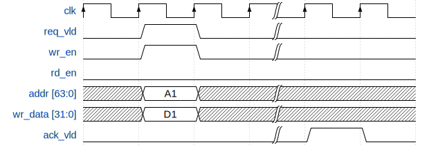

# **HJ-micro Register Design Automation Tool (HRDA Tool)**

## **Revision History**

| Date       | Revision | Description                               |
| ---------- | -------- | ----------------------------------------- |
| 2022-03-22 | 0.1.0    | Add regmst for deadlock detection.        |
| 2022-05-12 | 0.2.0    | Support IP-XACT integration in SystemRDL. |
| 2022-06-03 | 0.3.0    | Decouple regdisp from regslv.             |

<div STYLE="page-break-after: always;"></div>

## **0. HOW TO USE THIS MANUAL**

This reference manual focuses on following topics:

- what the RTL architecture (`regmst`, `regdisp`, `regslv`) generated by HRDA is like. ([2. RTL Architecture](#2-rtl-architecture))

- learn how to write SystemRDL to describe complicated registers and address space mappings. ([3. SystemRDL Coding Guideline](#3-systemrdl-coding-guideline))

  - the quickest way to write SystemRDL code: see [3.2 Overall Example](#32-overall-example)

- learn how to write Excel worksheets to describe simple registers. ([4. Excel Worksheet Guideline](#4-excel-worksheet-guideline))

  - the quickest way to write SystemRDL code: see [4.1 Table Format](#41-table-format)

- learn how to use the HRDA tool to get required output files. ([5. Tool Flow Guideline](#5-tool-flow-guideline))

For someone who is going to maintain HRDA code repository and update new features, please refer to another HRDA Code Wiki (not available yet).

<div style="page-break-after: always;"></div>

## **1. Introduction**

HJ-micro Register design Automation (HRDA) Tool is a command-line register automation tool developed by Python, which can be divided into two major parts: front-end and back-end. The front-end supports for generating register description templates in the Excel worksheet (.xlsx) format, parsing the **input Excel worksheets (.xlsx), SystemRDL (.rdl) and IP-XACT (.xml) files**. The back-end, or generator, supports for generating Register Transfer Level (RTL) Verilog/SystemVerilog modules, documentations, UVM Register Abstraction Layer (RAL) models and C header files.

For generating RTL modules with a few number of registers and simple address mapping, Excel worksheet is recommended. Nonetheless, for some complicated modules with numerous registers and sophisticated address mappings, SystemRDL is more expressive and flexible.

The overall HRDA tool flow is shown in [Figure 1.1](#pics_tool_flow).

<center>
    <br>
    <div style="display: inline-block;
        color: #999;
        padding: 5px;">Figure 1.1 HRDA tool flow
    </div>
</center>

<div style="page-break-after: always;"></div>

### **1.1 Register Template Generator**

The template generator provide convenience for designers who edit Excel worksheets. It generates several template tables including basic register definitions such as name, width, address offset, field definitions, etc., in one worksheet. Designers can refer to these templates and modify them to meet their own requirements.

See template format in [Figure 4.1](#pics_excel_temp_cn), [Figure 4.2](#pics_excel_temp_en).

### **1.2 Parser**

#### **1.2.1 Excel Parser**

The Excel parser check all Excel worksheets provided by the designer, including basic format and design rules, and then converts the parsed register specification model into SystemRDL code, which will be submitted to the `SystemRDL Compiler` later. Intermediate SystemRDL code generation also allows the designer to add more complicated features supported by SystemRDL.

To learn what rules are checked and how to write an acceptable Excel worksheet, see [4. Excel Worksheet Guideline](#4-excel-worksheet-guideline). Once any rule is violated, Excel parser will raise error message and indicate where error occurs.

#### **1.2.2 SystemRDL Parser/Compiler**

SystemRDL parser relies on an open-source project [SystemRDL Compiler](https://github.com/SystemRDL/systemrdl-compiler). SystemRDL Compiler is able to parse, compile, elaborate and check SystemRDL files followed by [SystemRDL 2.0 Specification](https://www.accellera.org/images/downloads/standards/systemrdl/SystemRDL_2.0_Jan2018.pdf) to generate a traversable and hierarchical register model as a Python object. Its basic workflow is shown in [Figure 1.2](#pics_systemrdl_compiler).

<center>
    <br>
    <div style="display: inline-block;
    color: #999;
    padding: 5px;">Figure 1.2 SystemRDL Compiler workflow </div>
</center>

Simple example:

```systemrdl
reg my_reg_t {
    field {} f1;
    field {} f2;
};

addrmap top {
    my_reg_t A[4];
    my_reg_t B;
};
```

Once compiled, the register model can be described like this:

<center>
    <br>
    <div style="display: inline-block;
    color: #999;
    padding: 5px;">Figure 1.3 hierarchical register model</div>
</center>

The hierarchical register model bridges the front-end and the back-end of HRDA. The front-end parser ultimately generates this model, and everything in the back-end is based on it after some pre-processing.

For a detailed description of this model, see SystemRDL Compiler Documentation : <https://systemrdl-compiler.readthedocs.io/en/stable/index.html>

#### **1.2.3 IP-XACT Importer**

The IP-XACT importer relies on an open-source project [PeakRDL-ipxact](https://github.com/SystemRDL/peakrdl-ipxact), and involves the ability to translate from IP-XACT data exchange document format to a SystemRDL register model.

Importing IP-XACT definitions can occur at any point alongside normal SystemRDL file compilation. When an IP-XACT file is imported, the register description is loaded into the SystemRDL register model as if it were an `addrmap` component declaration. Once imported, the IP-XACT contents can be used as-is, or referenced from another SystemRDL file.

### **1.3 Generator**

#### **1.3.1 Model Preprocessor**

The preprocessor traverse the register model compiled by the front-end, during which it modifies and double-check some node properties related to RTL generation.

To be more concrete:

- insert *hdl_path_slice* properties for each `field` instance
- complement user-defined properties for instances
  - *hj_genmst*
  - *hj_genslv*
  - *hj_gendisp*
  - *hj_flatten_addrmap*
  - *hj_use_abs_addr*
- check whether there are illegal assignments and try to fix some wrong property assignments
- filter some instances by assigning *ispresent = false*, thus the UVM RAL model won't consists of them
- complement RTL module names of all `addrmap` instances

#### **1.3.2 RTL Generator**

The RTL Generator is the core functionality of HRDA. It traverses the preprocessed register model and generate RTL code in Verilog/SystemVerilog format.

For the detailed architecture, see [2. RTL Architecture](#2-rtl-architecture).

#### **1.3.3 HTML Generator**

The HTML generator relies on an open-source project [PeakRDL-html](https://github.com/SystemRDL/peakrdl-html). It is able to generate address space documentation HTML file from the preprocessed register model. A simple example of exported HTML is shown in [Figure 1.4](#pics_html_ex).

<center>
    <br>
    <div style="display: inline-block;
        color: #999;
        padding: 5px;">Figure 1.4 HTML document example
    </div>
</center>

------------------------------

**Warning:** Once there are numerous registers, such as tens of thousands, the generation process and the response the generated HTML page will be very slow and stuck at the loading process.

------------------------------

#### **1.3.4 PDF Generator**

(TO BE DONE)

#### **1.3.5 UVM RAL Generator**

The export of the UVM register model relies on an open-source project [PeakRDL-uvm](https://github.com/SystemRDL/peakrdl-uvm).

#### **1.3.6 C Header Generator**

(TO BE DONE)

<div style="page-break-after: always;"></div>

## **2. RTL Architecture**

Control and status regsiters are distributed all around the chip in different subsystems, such as Network-on-chip (NoC), PCIe, MMU, SoC interconnect, Generic Interrupt Controller, etc. Not only hardware logic inside the respective subsystem, but also software needs to access them via system bus. HRDA provides a unified RTL architecture to make all these registers accessible by hardware, and software, namely visible to Application Processors (APs). All RTL modules generated by HRDA tool ultimately forms a network where each subsystem designer occupies one or more register trees (see more details in [2.1 Register Network](#21-register-network)).

<div style="page-break-after: always;"></div>

### **2.1 Register Network**

Register Network, or `reg_network`, is a multi-root hierarchical network. A typical network architecture is shown in [Figure 2.1](#pics_reg_network).


<center>
    <br>
    <div style="display: inline-block;
    color: #999;
    padding: 5px;">Figure 2.1 register network architecture</div>
</center>

The entire network consists of many Register Tree (`reg_tree`) modules generated by HRDA which may connect to upstream interconnect unit, such as ARM NIC-450 Non-coherent Interconnect. The number of `reg_tree` modules determines the number of interface the upstream interconnect forwards.

Register Access Master, or `regmst`, is the root of a `reg_tree`. It converts `APB` interface to Register Native Access Interface (`reg_native_if`). See more details in [2.2 Register Native Access Interface (reg_native_if)](#22-register-native-access-interface-reg_native_if). Designers can delicately write SystemRDL files to construct multiple `reg_tree` modules, and connect them to upstream NIC-450 to support concurrent register access between different `reg_tree`.

There are some submodules in `reg_tree`:

- Register Access Master (`regmst`): a module generated by HRDA that serves as the root node of `reg_tree`. It is responsible for transfer reception from upstream interconnect and transfer forwarding to downstream modules (actually `regdisp`), and monitoring child node status as well. See more details in [2.3 Register Access Master (regmst)](#23-register-access-master-regmst).

- Register Dispatcher (`regdisp`): a module generated by HRDA that selectively dispatches transactions from upstream `reg_native_if` to one or more downstream `reg_native_if` by absolute address or base offset. `regdisp` modules can be chained to serve as child nodes (but not terminal nodes) in `reg_tree`. See more details in [2.4 Register Dispatcher (regdisp)](#24-register-dispatcher-regdisp)

- Register Access Slave (`regslv`): a module generated by HRDA that contains all **internal** registers described in SystemRDL. According to design and generation principles, `regslv` modules can only be connected to `regdisp` and serve as terminal nodes in `reg_tree`. If some registers are declared to be **external** in SystemRDL, `regslv` won't generate their RTL code. See more details in [2.5 Register Access Slave (regslv)](#25-register-access-slave-regslv).

- 3rd party IP: registers in other 3rd party IPs can also be accessed by connecting themselves to `reg_tree` via `reg_native_if`. According to design and generation principles, 3rd party IPs can only be connected to `regdisp` nodes and serve as terminal nodes in `reg_tree`.

- Memory: in some situations, memory is used to implement logical registers. External memories can be mapped to the register address space and integrated into the unified management of `reg_network` via `reg_native_if`, at which point the system bus sees no difference in the behavior of memory accesses and register accesses. Memories can only be connected to `regdisp` and serve as terminal nodes in `reg_tree`.

All modules above is corresponding to some components defined in the SystemRDL description written by designers, and their relationship can be found in [3. SystemRDL Coding Guideline](#3-systemrdl-coding-guideline).

------------------------------

**Note:** `reg_network` and `reg_tree` are not the RTL code generation boundry. In other words, there is not a wrapper of `reg_network` and `reg_tree` (but maybe HDRA will implement `reg_tree` wrapper generation in a future release). For now, only separate `regmst`, `regdisp`, `regslv` and bridge components will be generated, so it all depends on designers how to connect `reg_tree` (`regmst` and `regslv`) to the upstream interconnect unit such as NIC-450.

------------------------------

### **2.2 Register Native Access Interface (reg_native_if)**

Typically, except that the upstream interface of `regmst` is `APB`, every module is connected into the register network as a child node in `reg_tree` via Register Native Access Interface (`reg_native_if`). `reg_natvie_if` is used under following circumstances in `reg_network`:

- `regmst <-> regdisp`

- `regdisp <-> regdisp`

- `regdisp <-> regslv`

- `regdisp <-> 3rd party IP`

- `regdisp <-> memory`

All signals are listed in [Table 2.2](#table_rni_def):

| Signal Name | Direction | Width | Description |
| ----------- | --------- | ----- | ----------- |
| req_vld | input from upstream, output to downsream | 1 | request valid |
| ack_vld | output to upstream, input from downsream | 1 | acknowledgement valid |
| addr | input from upstream, output to downsream | BUS_ADDR_WIDTH | address |
| wr_en | input from upstream, output to downsream | 1 | write enable |
| rd_en | input from upstream, output to downsream | 1 | read enable |
| wr_data | input from upstream, output to downsream | BUS_DATA_WIDTH | write data |
| rd_data | output to upstream, input from downsream | BUS_DATA_WIDTH | read data |
<center>
    <div id="table_rni_def" style="display: inline-block;
        color: #999;
        padding: 5px;">Table 2.2 reg_native_if signal definitions
    </div>
</center>

where `BUS_ADDR_WIDTH` defaults to 64 bit, and `BUS_DATA_WIDTH` defaults to 32 bit.

As mentioned before, `reg_native_if` can be forwarded to connect external memories or 3rd party IPs which serve as terminal nodes in `reg_tree`. The following [2.2.1 Write Transaction](#221-write-transaction) and [2.2.2 Read Transaction](#222-read-transaction) sections show basic transaction sequences to help designers integrate modules and connect wires.

For one read or write transaction, **`ack_vld` is not allowed to be asserted by downstream modules before `req_vld` is asserted**.

#### **2.2.1 Write Transaction**

There are two methods for write transactions. One is with no wait state: `ack_vld` is asserted once `req_vld` and `wr_en` raises. The other is with one or more wait states: `ack_vld` is asserted after `req_vld` and `wr_en` have raised for more than one cycles. `req_vld`, `addr`, `wr_en` and `wr_data` should be valid at the same cycle, and are valid for **only one cycle**.

<center>
    <br>
    <div style="display: inline-block;
        color: #999;
        padding: 5px;">Figure 2.3 write transaction with no wait state
    </div>
</center>

<center>
    <br>
    <div style="display: inline-block;
        color: #999;
        padding: 5px;">Figure 2.4 write transaction with one or more wait states
    </div>
</center>

#### **2.2.2 Read Transaction**

There are two methods for read transactions. One is with no wait state: `ack_vld` is asserted and `rd_data` are valid once `req_vld` and `rd_en` raises. The other is with one or more wait states: `ack_vld` is asserted after `req_vld` and `rd_en` have raised for more than one cycles. `req_vld`, `addr`, `rd_en` should be valid at the same cycle, and are valid for **only one cycle**.

<center>
    <br>
    <div style="display: inline-block;
        color: #999;
        padding: 5px;">Figure 2.5 read transaction with no wait state
    </div>
</center>

<center>
    <br>
    <div style="display: inline-block;
    color: #999;
    padding: 5px;">Figure 2.6 read transaction with one or more wait states
</div>
</center>

### **2.3 Register Access Master (regmst)**

The top-level (root) `addrmap` instance in SystemRDL corresponds to a `regmst` module, and the RTL module name (also file name) is `regmst_<suffix>`, where `<suffix>` is instance name of root `addrmap` in SystemRDL.

If input files are Excel worksheets only, all of them will be converted to SystemRDL and an extra top-level (root) `addrmap` will be automatically generated, the instance name is `excel_top` or assigned by `-m/--module` option (see [5.2 Command Options and Arguments](#52-command-options-and-arguments)).

`regmst` is the root node of `reg_tree`, and is responsible for monitoring all downstream nodes. [Figure 2.7](#pics_regmst_rtl_infra) shows the architecture of `regmst`.

<center>
    <br>
    <div style="display: inline-block;
        color: #999;
        padding: 5px;">Figure 2.7 regmst architecture
    </div>
</center>

`regmst` bridges SoC-level interconnect (`APB` now) and `reg_native_if`. `addr_decoder` decodes the **absolute address** from `APB` interface and `mst_fsm` launches the access request to downstream modules (actually `regdisp`).

Then `regmst` starts a timer. If a timeout event occurs in waiting for response from downstream modules, `regmst` responds to the upstream interconnect with `PREADY` and `PSLVERR` asserted, and with fake data `0xdead_1eaf` if it is a read transaction, and aseerts an interrupt to report the timeout event. Meanwhile, unresponded request information is logged in local registers of `regmst` and software is able to determine the problematic module by reading them. Software also can assert soft reset by writing to the soft-reset register, which results in `regmst` broadcasting a synchronous reset signal to all downstream modules so that all sequential logic (FSM in `regslv`, all flip-flops, bridge components, etc.) can be reset to prevent `reg_tree` from being stuck in waiting for response (`ack_vld`).

`regmst` module does not support outstanding transactions, so the process logic is quite straitforward:

  1. Once receiving an APB transaction, `addr_decoder` in `regmst` decodes the **absolute address** to determine whether current access belongs to its downstream modules

  2. `regmst` forwards access to the downstream `regdisp` module, then waits for response (`ack_vld`), and starts a timer as well.

     - If downstream modules responds with `ack_vld` asserted in `reg_native_if`, `regmst` responds to the upstream interconnect with `PREADY` asserted in `APB` interface, then `mst_fsm` resets timer and returns to idle state.

     - If a timeout event occurs, `regmst` logs current address, finishes the transaction with `PREADY` and `PSLVERR` asserted, and returns fake data if it is a read transaction, and asserts the interrupt signal.

     - Software sets the soft-reset register inside `regmst` which then asserts global synchronous reset signal to all downstream modules.

With regard to clock domain, `regmst` runs on the register native domain (typically 50MHz).

[Table 2.8](#table_regmst_ports) shows port definitions of `regmst`.

// TODO
|    Port     | Direction | Width | Description |
| ----------- | --------- | ----- | ----------- |
<center>
    <div id="table_regmst_ports" style="display: inline-block;
        color: #999;
        padding: 5px;">Table 2.8 regmst port definition
    </div>
</center>

### **2.4 Register Dispatcher (regdisp)**

The immediate sub-addrmap instance of root `addrmap` or any `addrmap` instance which is assigned *hj_gendisp = true* corresponds to a `regdisp` module, and the RTL module name (also file name) is `regdisp_<suffix>`, where `<suffix>` is current `addrmap` instance name in SystemRDL.

`regdisp` is responsible for one-to-many access request dispatch like an inverse multiplexor, and it is **the only module in `reg_tree` that can connect multiple downstream modules which may be `regslv` modules implementing internal registers, 3rd party IPs, external memories or another `regdisp` module via `reg_native_if`**. [Figure 2.9](#pics_regdisp_rtl_infra) shows the architecture of `regdisp`.

<center>
    <br>
    <div style="display: inline-block;
        color: #999;
        padding: 5px;">Figure 2.9 regdisp architecture
    </div>
</center>

As [Figure 2.9](#pics_regdisp_rtl_infra) shows, `regdisp` has additional optional functionalities based on design requirements described in SystemRDL by explicitly assigning user-defined properties such as *hj_use_abs_addr*, *hj_use_upstream_ff*, *hj_use_backward_ff* in `addrmap` components (see [3.1.10 Addrmap Component](#3110-addrmap-component)):

- Convert absolute address to base offset in `reg_native_if::addr` (assign *hj_use_abs_addr = false* in current `addrmap` representing for `regdisp`)

  - If base address of the downstream module is aligned, simply clip several high bits of `addr`. For example,

    ```verilog
    // cut 48 higher bits and reserve only 16 lower bits
    assign  downstream__addr_pre[0] = {48'b0, downstream__addr_imux[0]][15:0]};
    ```

  - Otherwise, generate a subtractor. For example,

    ```verilog
    // base address is 0x20c
    assign  downstream__addr_pre[0] = downstream__addr_imux[0] - 64'h20c;
    ```

- Insert DFFs alongside the forward datapath of `reg_native_if` (assign *hj_use_upstream_ff = true* in immediate sub-addrmap of current `addrmap` representing for `regdisp`)

- Insert a DFF alongside the backward datapath of `reg_native_if` (assign *hj_use_backward_ff = true* in current `addrmap` representing for `regdisp`)

With regard to clock domain, `regdisp` runs on the register native domain (typically 50MHz).

[Table 2.10](#table_regdisp_ports) shows port definitions of `regdisp`.

|    Port             | Direction | Width | Description |
| ------------------  | --------- | ----- | ----------- |
| upstream__req_vld   | input     | 1 |
| upstream__ack_vld   | output    | 1 |
| upstream__wr_en     | input     | 1 |
| upstream__rd_en     | input     | 1 |
| upstream__addr      | input     | BUS_ADDR_WIDTH |
| upstream__wr_data   | input     | BUS_DATA_WIDTH |
| upstream__rd_data   | output    | BUS_DATA_WIDTH |
| downstream__req_vld | output    | 1 |
| downstream__ack_vld | input     | 1 |
| downstream__wr_en   | output    | 1 |
| downstream__rd_en   | output    | 1 |
| downstream__addr    | output    | BUS_ADDR_WIDTH |
| downstream__wr_data | output    | BUS_DATA_WIDTH |
| downstream__rd_data | input     | BUS_DATA_WIDTH |
<center>
    <div id="table_regdisp_ports" style="display: inline-block;
        color: #999;
        padding: 5px;">Table 2.10 regdisp port definition
    </div>
</center>

### **2.5 Register Access Slave (regslv)**

`regslv` modules are used to implement internal registers. Any `addrmap` instance which is assigned *hj_genslv = true* or an Excel worksheet corresponds to a `regslv` module, and the RTL module name (also file name) is `regslv_<suffix>`, where `<suffix>` is the `addrmap` instance name in SystemRDL or Excel worksheet name.

[Figure 2.11](#pics_regslv_rtl_infra) shows the architecture of `regslv`.

<center>
    <br>
    <div style="display: inline-block;
        color: #999;
        padding: 5px;">Figure 2.11 regslv architecture
    </div>
</center>

`regslv` is the terminal node in `reg_tree` and its immediate parent node is `regdisp`, so it does not forward any interface. Designers should use `regdisp` if they want to forward interface to 3rd party IPs or external memories.

[Table 2.12](#table_regdisp_ports) shows port definition of `regslv`.

// TODO
|    Port     | Direction | Width | Description |
| ----------- | --------- | ----- | ----------- |
<center>
    <div id="table_regslv_ports" style="display: inline-block;
        color: #999;
        padding: 5px;">Table 2.12 regslv port definition
    </div>
</center>

#### **2.5.1 slv_fsm**

`slv_fsm` is a finite state machine (FSM) that copes with transactions dispatched from the upstream `regdisp` module and controls read and write access to internal registers. Its operating states are shown in [Figure 2.13](#pics_slv_state).

// TODO
<center>
    <br>
    <div style="display: inline-block;
        color: #999;
        padding: 5px;">Figure 2.13 transition diagram of slv_fsm
    </div>
</center>

#### **2.5.2 addr_decoder**

// FIXME

```verilog
always_comb begin
    reg_sel = {REG_NUM{1'b0}};
    dummy_reg = 1'b0;
    unique casez (regfile_addr)
        64'h0:reg_sel[0] = 1'b1;
        64'h4:reg_sel[1] = 1'b1;
        default: dummy_reg = 1'b1;
    endcase
end
```

#### **2.5.4 split_mux**

// FIXME

`split_mux` is a one-hot multiplexor with a parameter to specify `group_size`. When number of input candidcates exceed `group_size`, a two-level multiplexor network is constructed and DFFs are inserted between two levels to improve timing performance.

#### **2.5.5 snapshot module**

// FIXME

#### **2.5.6 value_deliver**

// FIXME

### **2.6 Register and Field**

// FIXME

`field` is the structural component at the lowest level. The `field` architecture is shown in [Figure 2.14](#pics_field_rtl_infra).

<center>
    <br>
    <div style="display: inline-block;
        color: #999;
        padding: 5px;">Figure 2.14 field architecture
    </div>
</center>

The `field` module implements hardware and software access types defined in Excel worksheets and SystemRDL.

`sw_ctrl` unit corresponds to software access (read and write) types in Excel worksheets and SystemRDL. It uses software access signals from `slv_fsm` in `regslv`, which are initially forwarded by `reg_native_if` from upstream modules.

All supported software access types are listed in [Table 2.15](#table_sw_acc_prop). `field` can be readable and writeable, write only once, and has some read or write side-effects on software behavior. Additionally, *alias* and *shared* property in SystemRDL can be used to describe `reg` if designers wants to generate registers with more than one software address locations and access types but only one physical implementation. If *alias* or *shared* property is assigned in SystemRDL, a corresponding number of software control (`sw_ctrl`) units will be generated. So for simple register description without *alias* or *shared* property, there is only one `sw_ctrl` unit.

| Software Access Type | Description                     |
| -------------------- | ------------------------------- |
| RO                   | read only                       |
| RW                   | read and write                  |
| RW1                  | read and write once after reset |
| WO                   | write only                      |
| W1                   | write once after reset          |
| RCLR                 | clear on read                   |
| RSET                 | set on read                     |
| WOCLR                | write 1 to clear                |
| WOSET                | write 1 to set                  |
| WOT                  | write 1 to toggle               |
| WZS                  | write 0 to set                  |
| WZC                  | write 0 to clear                |
| WZT                  | write 0 to toggle               |
<center>
    <div id="table_sw_acc_prop" style="display: inline-block;
        color: #999;
        padding: 5px;">Table 2.15 supported software access (read and write) types
    </div>
</center>

`hw_ctrl` unit corresponds to hardware access types in Excel worksheets and SystemRDL. It simply uses `hw_pulse` and `hw_value` for hardware access, and these two signals also appear in `regslv` module port declaration if the `field` instance they belong to are writeable on hardware behavior.

All supported hardware access types are listed in [Table 2.16](#table_hw_acc_prop).

| Hardware Access Type | Description                                 |
| -------------------- | ------------------------------------------- |
| RO | read only, thus `<field_name>__pulse` and `<field_name>__next_value` are not generated as `regslv` ports |
| WO | write only, thus `<field_name>__curr_value` are not generated as `regslv` ports |
| RW | read, and write when `hw_pulse` is asserted |
| CLR | bitwise clear, and `hw_pulse` input is ignored |
| SET | bitwise set, and `hw_pulse` input is ignored |
<center>
    <div id="table_hw_acc_prop" style="display: inline-block;
        color: #999;
        padding: 5px;">Table 2.16 supported software access (read and write) types
    </div>
</center>

All supported sodtware and hardware access types also can be found in a generated verilog header file `field_attr.vh`.

------------------------------

**Note:** `hw_pulse` and `hw_value` correspond to `<field_inst_name>__pulse` and `<field_inst_name>__next_value` as port names of `regslv`, and `field_value` corresponds to `<field_inst_name>__curr_value` as the port name of `regslv`.

------------------------------

Additionally, there are some other advanced features in SystemRDL that can be implemented and generated as RTL code. See more in [SystemRDL Coding Guideline](#systemrdl-coding-guideline).

`field` is concatenated to form `register` and mapped into address space for software access, as shown in [Figure 2.17](#pics_field_concat_reg).

// FIXME
<center>
    <br>
    <div style="display: inline-block;
        color: #999;
        padding: 5px;">Figure 2.17 fields are concatenated to form registers
    </div>
</center>

### **2.7 Detailed Register Tree Architecture and Performance Evaluation**

// FIXME

<div style="page-break-after: always;"></div>

## **3. SystemRDL Coding Guideline**

SystemRDL is a language for the design and delivery of intellectual property (IP) products used in designs. SystemRDL semantics supports the entire life-cycle of registers from specification, model generation, and design verification to maintenance and documentation. Registers are not just limited to traditional configuration registers, but can also refer to register arrays and memories.

This chapter is based on the [SystemRDL 2.0 Specification](https://www.accellera.org/images/downloads/standards/systemrdl/SystemRDL_2.0_Jan2018.pdf). In other words, it specifies a subset of SystemRDL syntax and features to use, and some pre-defined properties under this framework. What's more significant, **except for general concepts and rules which may not be covered in [3.1 General Concepts, Rules, and Properties](#31-general-concepts-rules-and-properties) completely, HRDA Tool only interpret SystemRDL features mentioned in this chapter, namely other features are not supported and make no sense or even raise some unknown error in the tool back-end generation process**.

<div style="page-break-after: always;"></div>

### **3.1 General Concepts, Rules, and Properties**

------------------------------

**Def:** Some definition marks and conventions in this chapter:

- `[]` indicates optional parameters. For example, the value assignment is optional in the following line:

  `default property_name [= value];`

- `{}` indicates items that can be repeated zero or more times. For example, the following shows one or more universal properties can be specified for this command:

  `mnemonic_name = value [{{universal_property;}*}];`

- `*` signifies that parameter can be repeated. For example, the following line means multiple properties can be specified for this command:

  `field {[property;]*} name = value;`

------------------------------

#### **3.1.1 Component Definition**

A component in SystemRDL is the basic building block or a container which contains properties that further describe this component’s behavior. There are several structural components in SystemRDL: `field`, `reg`, `mem`, `regfile`, and `addrmap`. All structural components are supported in HRDA Tool, and their mappings to RTL module are as follows:

- `field` describes fields in registers.

- `reg` describes registers that contains many fields

- `regfile` is used to pack the same sort of registers together to make it easier to orgnize them and understand their meaning. `regfile` is also used to allocate an base address.

- `addrmap`: similar to `regfile` on packing register and allocating addresses. What's different and more important, `addrmap` defines the **RTL code generation boundary**. There are five types of `addrmap` which corresponds to `regmst`, `regdisp`, `regslv`, `3rd party IP` and no module in RTL architecture respectively, and they are distinguished by user-defined properties in HRDA (see [3.1.10 Addrmap Component](#3110-addrmap-component)).

Additionally, HRDA supports a non-structural component, `signal`. Signals are used to describe synchronous resets of `field`. But SystemRDL specification does not seem to allow direct reference to `signal` components in property assignment by their names, so HRDA implements it by assigning a string to a user-defined property named `hj_syncresetsignal`, see [3.1.5 Signal Component](#315-signal-component)) and [3.1.6 Field Component](#316-field-component).

SystemRDL components can be defined in two ways: *definitively* or *anonymously*.

- *Definitive* defines a named component type, which is instantiated in a separate statement. The definitive definition is suitable for reuse.

- *Anonymous* defines an unnamed component type, which is instantiated in the same statement. The anonymous definition is suitable for components that are used once.

A *definitive* definition of a component appears as follows.

```systemrdl
component new_component_name [#(parameter_definition [, parameter_definition]*)]
{[component_body]} [instance_element [, instance_element]*];
```

An *anonymous* definition (**and also instantiation**) of a component appears as follows.

```systemrdl
component {[component_body]} instance_element [, instance_element]*;
```

More explanations:

- `component` is one of the keywords mentioned above (`field`, `reg`, `regfile`, `addrmap`, `signal`).

- For a *definitively* defined component, `new_component_name` is the user-specified name for the component.

- For a *definitively* defined component, `parameter_definition` is the user-specified parameter as defined like this:

  ```systemrdl
  parameter_type parameter_name [= parameter_value]
  ```

  where `parameter_type` is a type reference taken from the list of SystemRDL types, `parameter_name` is a user-specified parameter name, and `parameter_value` is an expression whose resolved type should be consistent with `parameter_type`.

- For an *anonymously* defined component, `instance_element` is the description of instantiation attributes, as defined like this:

  ```systemrdl
  instance_name [{[constant_expression]}* | [constant_expression : constant_expression]][addr_alloc]
  ```

- The `component_body` is comprised of zero or more of the following.

  - Default property assignments

  - Property assignments

  - Component instantiations

  - Nested component definitions

- The first instance name of an *anonymous* definition is also used as the component type name.

- The *address allocation operators* like *stride* (`+=`), *alignment* (`%`), and *offset* (`@`) of *anonymous* instances are the same as the definitive instances. See [3.1.4.3 Address Allocation Operator](#3143-address-allocation-operator) for more information.

Components can be defined in any order, as long as each component is defined before it is instantiated. **All structural components (and signals) need to be instantiated before being generated.**

Here is an example for register definition, where the register `myReg` is a definitive definition, and the field `data` is an *anonymous* definition (also instantiation):

```systemrdl
reg myReg #(longint unsigned SIZE = 32, boolean SHARED = true) {
    regwidth = SIZE;
    shared = SHARED;
    field {} data[SIZE – 1];
};
```

For more details, see [SystemRDL 2.0 Specification](https://www.accellera.org/images/downloads/standards/systemrdl/SystemRDL_2.0_Jan2018.pdf) Chapter 5.1.1.

#### **3.1.2 Component Instantiation and Parameterization**

In a similar fashion to defining components, SystemRDL components can be instantiated in two ways.

- A *definitively* defined component is instantiated in a separate statement, as follows:

  ```systemrdl
  type_name [#(parameter_instance [, parameter_instance]*)] instance_element [, instance_element]* ;
  ```

  For example:

  ```systemrdl
  // myReg is defined before
  myReg reg_0, reg_1, reg_2;
  ```

- An *anonymously* defined component is instantiated in the statement that defines it. For example:

  ```systemrdl
  // The following code fragment shows a simple scalar field component instantiation
  field {} myField; // single bit field instance named "myField"

  // The following code fragment shows a simple array field component instantiation.
  field {} myField[8]; // 8 bit field instance named "myField"
  ```

Parameters can be overwritten during component instantiation. Here is an example:

```systemrdl
addrmap myAmap {
    myReg reg32;
    myReg reg32_arr[8];
    myReg #(.SIZE(16)) reg16;
    myReg #(.SIZE(8), .SHARED(false)) reg8;
};
```

For more details, see [SystemRDL 2.0 Specification](https://www.accellera.org/images/downloads/standards/systemrdl/SystemRDL_2.0_Jan2018.pdf) Chapter 5.1.2.

#### **3.1.3 Component Property**

In SystemRDL, components have various properties to determine their behavior. For built-in properties, there are general component properties and specific properties for each component type (`field`, `reg`, `addrmap`, etc.) in SystemRDL. Each property is associated with at least one data type (HRDA supports *boolean*, *string*, *bit*, *longint unsigned*, *accesstype*, *addressingtype*, *onreadtype*, *onwritetype*, *precedencetype*, *array*). In addition to build-in properties, SystemRDL also supports for user-defined properties, and HRDA tool pre-defines some user-defined properties to assist RTL module generation process, which are concretely specified in following chapters of each component type.

##### **3.1.3.1 Property Assignment**

A property assignment appears as follows:

```systemrdl
    property_name [= expression];
```

When expression is not specified, it is presumed the `property_name` is of type boolean and the default value is set to `true`.

For example:

```systemrdl
field myField {
    rclr; // Bool property assign, set implicitly to true
    woset = false; // Bool property assign, set explicitly to false
    name = "my field"; // string property assignment
    sw = rw; // accesstype property assignment
};
```

##### **3.1.3.2 Property Default Value**

Default values for a given property can be set within the current or any enclosing lexical scope. Any components defined in the same or enclosed lexical scope as the default property assignment shall use the default values for properties in the component not explicitly assigned in a component definition. A  specific property default value shall only be set once per scope. A default property assignment appears as follows.

```systemrdl
default property_name [= value];
```

When the value is not specified, the property shall be assigned the boolean value *true*.

For example:

```systemrdl
field {} outer_field ;
reg {
    default name = "default name";
    field {} f1; // assumes the name "default name" from above
    field { name = "new name";} f2; // name assignment overrides "default name"
    outer_field f3 ; // name is undefined, since outer_field is not
                     // defined in the scope of the default name
} some_reg;
```

##### **3.1.3.3 Dynamic Assignment**

Properties can be assigned in two ways. One is at the definition time like the example above, the other way is called *dynamic assignment* using the `->` operator. For example:

```systemrdl
reg {
    field {} f1;
    f1->name = "New name for Field 1";
} some_reg[8];

some_reg->name = "This value is applied to all elements in the array";
some_reg[3]->name = "Only applied to the 4th item in the array of 8";
```

Dynamic assignment allows the designer to overwrite or assign properties outside component definitions, thus provides much convenience for component instantiation.

##### **3.1.3.4 Supported General Properties**

All general component properties supported by HRDA are described in [Table 3.1](#table_general_prop), and other supported component-specific properties are also discussed in following chapters.

| Property | Description                                                    | Type       | Dynamic Assignment |
| -------- | -------------------------------------------------------------- | ---------- | ------------------ |
| name     | Specifies a more descriptivename (for documentation purposes). | *string*   | Support            |
| desc     | Describes the component’s purpose.                             | *string*   | Support            |
<center>
    <div id="table_general_prop" style="display: inline-block;
        color: #999;
        padding: 5px;">Table 3.1 all supported general component properties
    </div>
</center>

#### **3.1.4 Instance Address Allocation**

The offset of an component instance is relative to its parent component instance. If an instance is not explicitly assigned an address using address allocation operators (see [Address Allocation Operator](#3143-address-allocation-operator)), HRDA assigns the address according to the alignment and addressing mode. The address of an instance from the top-level `addrmap` is calculated by adding the instance offset and the offset of all its parent instances.

##### **3.1.4.1 Alignment**

The `alignment` property supported in `addrmap` and `regfile` components defines the byte value of which addresses of all instances inside the corresponding addressable component instance shall be a integral multiple. The value of `alignment` shall be a power of two ($2^N$) and is inherited by all child component instances. By default, instantiated components shall be aligned to a multiple of their width (e.g., the address of a 64-bit register is aligned to the next 8-byte boundary).

A simple example:

```systemrdl
regfile fifo_rfile {
    alignment = 8;
    reg {field {} a;} a; // Address of 0
    reg {field {} a;} b; // Address of 8. Normally would have been 4
};
```

##### **3.1.4.2 Addressing Mode**

The `addressing` property can only be used in `addrmap` component. There are three addressing modes: `compact`, `regalign` (default), and `fullalign`.

- `compact` specifies the components are packed tightly together but are still aligned to the `accesswidth` parameter. Examples are as follows.

```systemrdl
addrmap some_map {
    default accesswidth=32;
    addressing=compact;
    reg { field {} a; } a; // Address 0x0 - 0x3: 4 bytes
    reg { regwidth=64; field {} a; } b; // Address 0x4 - 0x7: lower 32-bit,
                                        // Address 0x8 - 0xB: higher 32-bit
                                        // starting address 0x4 tightly follows previous
                                        // reg "a"
    reg { field {} a; } c[20]; // Address 0xC  - 0xF:  Element 0
                               // Address 0x10 - 0x13: Element 1
                               // Address 0x14 - 0x17: Element 2
};
```

```systemrdl
addrmap some_map {
    default accesswidth=64;
    addressing=compact;
    reg { field {} a; } a; // Address 0x0 - 0x3: 4 bytes
    reg { regwidth=64; field {} a; } b; // Address 0x8 - 0xB:
    reg { field {} a; } c[20]; // Address 0x10 - Element 0
                               // Address 0x14 - Element 1
                               // Address 0x18 - Element 2
                               // starting address is 0x10, align to 64-bit, 4 bytes in 0xC-0xF is skipped
};
```

- `regalign` (default) specifies the components are packed in a way that each component's start address is a multiple of its size (in bytes). Array elements are aligned according to the individual element's size (this results in no gap between the array elements). This generally results in simpler address decode logic. Examples are as follows.

```systemrdl
addrmap some_map {
  default accesswidth = 32;
  addressing = regalign;
  reg { field {} a; } a; // Address 0x0
  reg { regwidth=64; field {} a; } b; // Address 0x8-0xF, align to 64-bit
  reg { field {} a; } c[20]; // Address 0x10
                             // Address 0x14 - Element 1
                             // Address 0x18 - Element 2
};
```

- `fullalign` The assigning of addresses is similar to `regalign` except for arrays. The alignment value for the first element in an array is the size in bytes of the whole array (i.e., the size of an array element multiplied by the number of elements), rounded up to nearest power of two. The second and subsequent elements are aligned according to their individual size (so there are no gaps between the array elements).

```systemrdl
addrmap some_map {
  default accesswidth = 32;
  addressing = fullalign;
  reg { field {} a; } a; // Address 0
  reg { regwidth=64; field {} a; } b; // Address 8
  reg { field {} a; } c[20]; // Address 0x80 - Element 0
                             // Address 0x84 - Element 1
                             // Address 0x88 - Element 2
                             // starting address align to 4*20=80Byte,
};
```

##### **3.1.4.3 Address Allocation Operator**

When instantiating `reg`, `regfile`, `mem`, or `addrmap`, the address
may be assigned using one of following address allocation operators.

- *offset* (`@`) : It specifies the address for the instance.

    ```systemrdl
    addrmap top {
    regfile example{
        reg some_reg {
        field {} a;
        };
        some_reg a @0x0;
        some_reg b @0x4;
        // Implies address of 8
        // Address 0xC is not implemented or specified
        some_reg c;
        some_reg d @0x10;
        };
    };
   ```

- *stride* (`+=`) : It specifies the address stride when instantiaing an array of components (controls the spacing of the components). The address stride is relative to the previous instane's address. It is only used for arrayed `addrmap`, `regfile`, `reg`, or `mem`.

    ```systemrdl
    addrmap top {
    regfile example {
        reg some_reg { field {} a; };

        some_reg a[10]; // So these will consume 40 bytes
                        // Address 0,4,8,C....

        some_reg b[10] @0x100 += 0x10; // These consume 160-12 bytes of space
                                    // Address 0x100 to 0x103, 0x110 to 0x113,....
        };
    };
    ```

- *alignment* (`%`) : It specifies the aligment of address when instantiaing a component (controls the aligment of the components like property `alignment` does). The initial address alignment is relative to the previous instance's address. `@` and `%=` are mutually exclusive per instance.

    ```systemrdl
    addrmap top {
      regfile example {
          reg some_reg { field {} a; };

          some_reg a[10]; // So these will consume 40 bytes
                          // Address 0,4,8,C....

          some_reg b[10] @0x100 += 0x10; // These consume 160-12 bytes of space
                                      // Address 0x100 to 0x103, 0x110 to 0x113,...

          some_reg c %=0x80; // This means ((address % 0x80) == 0))
                          // So this would imply an address of 0x200 since
                          // that is the first address satisfying address>=0x194
                          // and ((address % 0x80) == 0)
      };
    };
    ```

### **3.1.5 Signal Component**

The `signal` component does not support any property other than general properties in [Table 3.1](#table_general_prop), and all signals are treated and used as synchronous reset of `field` components, thus the user-defined property `hj_syncresetsignal` can be only assigned in `field` components.

For example:

```systemrdl
addrmap foo {
    signal {} mySig;
};
```

### **3.1.6 Field Component**

#### **3.1.6.1 RTL Naming Convention**

Each `field` instance in SystemRDL will be generated to a `field` module instance in `regslv` RTL module. In generated RTL code, stem name of field is `<reg_inst_name>__<field_inst_name>`. Other signals belong to the field are named by prefixing/suffixing elements.

For example, register instance name is `ring_cfg`, field instance name is `rd_ptr`:

1. `field` instance name is `x__<stem>` (prefixed with `x__`): `x__ring_cfg__rd_ptr`

2. output port name for current field value is `<stem>__curr_value`: `ring_cfg__rd_ptr__curr_value`

3. input port for update its value from hardware is `<stem>__next_value`: `ring_cfg__rd_ptr__next_value`

4. input port for qualifying the input update value is `<stem>__pulse`: `ring_cfg__rd_ptr__pulse`

#### **3.1.6.2 Description Guideline**

All specific properties supported in `field` component besides general component properties in [Table 3.1](#table_general_prop) are listed in [Table 3.2](#table_field_prop)

| Property | Notes | Type | Default | Dynamic Assignment |
|----------|-------|------|---------|--------------------|
| `fieldwidth`      | Width of field.                                                                                                                   | *longint unsigned* | 1       | Not Support  |
| `reset`           | Reset value of field.                                                                                                             | *bit*              | 0       | Support |
| `hj_syncresetsignal` | Signal names used as *synchronous reset* of the field.                                                                  | *reference*        |         | Support |
| `name`            | Specifies a more descriptive name (for documentation purposes).                                                                   | *string*           | ""      | Support |
| `desc`            | Describes the component's purpose.  MarkDown syntax is allowed                                                                    | *string*           | ""      | Support |
| `sw`              | Software access type, one of `rw`, `r`, `w`, `rw1`, `w1`, or `na`.                                                                | *access type*      | `rw`    | Support |
| `onread`          | Software read side effect, one of `rclr`, `rset`, or `na`.                                                                        | *onreadtype*       | `na`    | Support |
| `onwrite`         | Software write side effect, one of `woset`, `woclr`, `wot`, `wzs`, `wzc`, `wzt`, or `na`.                                         | *onwritetype*      | `na`    | Support |
| `swmod`           | Populate an output signal which is asserted when field is modified by software (written or read with a set or clear side effect). | *boolean*          | false   | Support |
| `swacc`           | Populate an output signal which is asserted when field is read.                                                                   | *boolean*          | false   | Support |
| `singlepulse`     | Populate an output signal which is asserted for one cycle when field is written 1.                                                | *boolean*          | false   | Support |
| `hw`              | Hardware access type, one of `rw`, or `r`                                                                                         | *access type*      | `r`     | Not Support  |
| `hwclr`           | Hardware clear.  field is cleared upon assertion on hardware signal in bitwise mode.                                              | *boolean*          | false   | Support |
| `hwset`           | Hardware set.  field is set upon assertion on hardware signal in bitwise mode.                                                    | *boolean*          | false   | Support |
| `precedence`      | One of `hw` or `sw`, controls whether precedence is granted to hardware (`hw`) or software (`sw`) when contention occurs.         | *precedencetype*   | `sw`    | Support |
<center>
    <div id="table_field_prop" style="display: inline-block;
        color: #999;
        padding: 5px;">Table 3.2 supported field component properties
    </div>
</center>

More explanations:

`hj_syncresetsignal` is an user-defined property that refer to `signal` components used as synchronous reset for `field` instances. By default, a field doesn't have synchronous reset. Register designers can set `hj_syncresetsignal` property to specify multiple synchronous reset signals. For example:

```systemrdl
reg REG_def {
    regwidth = 32;
    field {
      sw = rw;
    } FIELD_0[31:0] = 0xaaaaaaaa;
};
signal {} srst_1, srst_2, srst_3;

REG_def REG1_SRST;
REG1_SRST.FIELD_0 -> hj_syncresetsignal = "srst_1,srst_2,srst_3";
```

Each synchronous reset signal must be active high and one clock cycle wide. Reset value of synchronous reset is the same as that of asynchronous reset. Assigning `hj_syncresetsignal` property in a `field` instance will generate extra input ports in the corresponding field RTL module and the parent `regslv` module as a synchornous reset signal.

When `singlepulse` is `true`, `onwrite` property is ignored.

Current value of field (`<stem>__curr_value`) always exists as an output port in `regslv`. If `hw = rw`, two more inputs are populated (`<stem>__next_value` and `<stem>__pulse`) for updating field value from user logic. If value from hardware is expected to be continously updated into field, user should tie `<stem>__pulse` to `1'b1`. If either `hwclr` or `hwset` is `true` (they are mutually exclusive), `field` module use `<stem>__next_value` in bitwide mode and ignores `<stem>__pulse`. Each pulse in `<stem>__next_value` will clear or set corresponding bit on `field`.

#### **3.1.6.3 Examples**

```systemrdl
field {sw=rw; hw=r;} f1[15:0] = 1234;

field f2_t {sw=rw; hw=r;};

f2_t f2[16:16] = 0;
f2_t f3[17:17] = 0;

field {
    sw=rw;
    hw=r;
} f4[31:30] = 0;

field {
    sw=rw; hw=r;
} f5[29:28] = 0;
```

### **3.1.7 Register Component**

#### **3.1.7.1 RTL Naming Convention**

Each `reg` instance is a concatenation of `field` instance. In RTL code, no module is implemented for Register. Instead, an `always_comb` block is used to concatenate `curr_value` of `field`. For example:

```verilog
// ring_cfg
always_comb begin
   ring_cfg[31:0] = 32'd0;
   ring_cfg[31]   = ring_cfg__ring_en__curr_value;
   ring_cfg[7:4]  = ring_cfg__ring_size__curr_value[3:0];
end
```

All `field` components in a `reg` share same register `rd_en`, `wr_en`, and `wr_data`.  HRDA tool will connect the correct signal from address decoder to field instances.

#### **3.1.7.2 Description Guideline**

Register definitions are all considered to be *internal*.  *external* is only applied on `regfile` instances.

Additionally, *alias* property is supported on regsiter instances within regfile.

An *alias register* is a register that appears in multiple locations of the same address map. It is physically implemented as a single register such that a modification of the register at one address location appears at all the locations within the address map. From the perspective of software, the accessibility of this register may be different in each address location of the address block.

Alias registers are allocated addresses like physical registers and are decoded like physical registers, but they perform these operations on a previously instantiated register (called the primary register).  Since alias registers are not physical, hardware access and other hardware operation properties are not used. Software access properties for the alias register can be different from the primary register. For example:

```systemrdl
reg some_intr_r { field { level intr; hw=w; sw=r; woclr; } some_event; };
addrmap foo {
  some_intr event1;

  // Create an alias for the DV team to use and modify its properties
  // so that DV can force interrupt events and allow more rigorous structural
  // testing of the interrupt.
  alias event1 some_intr event1_for_dv;
  event1_for_dv.some_event->woclr = false;
  event1_for_dv.some_event->woset = true;
};
```

Another similar property, *shared*, allows the same physical register to be mapped in different address locations.

Registers which *share* or *alias* the same `reg` type are all generated in the same `regslv`. *alias* registers only can be used in one `addrmap`. *shared* registers can be used across different `addrmap` instances whose `hj_flatten_addrmap` is assigned to *true* to make them integrated in the same `regslv` RTL module.

All supported properties are listed in [Table 3.3](#table_reg_prop).

| Property      | Notes                                                              | Type               | Default | Dynamic Assignment |
|---------------|--------------------------------------------------------------------|--------------------|---------|--------------------|
| `regwidth`    | Width of Register.                                                 | *longint unsigned* | 32      | Not Support        |
| `accesswidth` | Minimum software access width operation performed on the register. | *longint unsigned* | 32      | Not Support        |
| `shared`      | Defines a register as being shared in different address maps.      | *boolean*          | false   | Not Support        |
<center>
    <div id="table_reg_prop" style="display: inline-block;
        color: #999;
        padding: 5px;">Table 3.3 supported register component properties</div>
</center>

#### **3.1.7.3 Example**

```systemrdl
reg my64bitReg {
    regwidth = 64;
    field {} a[63:0]=0;
};
reg my32bitReg { regwidth = 32;
    accesswidth = 16;
    field {} a[16]=0;
    field {} b[16]=0;
};
```

### **3.1.8 Regfile Component**

#### **3.1.8.1 Description Guideline**

A `regfile` is as a logical grouping of one or more registers and `regfile` instances. It packs registers together and provides address allocation support, which is useful for introducing an address gap between registers. The only difference between the `regfile` and the address map (`addrmap`) is an `addrmap` defines an RTL implementation boundary where the `regfile` does not. Since `addrmap` define a implementation block boundary, there are some specific properties that are only specified for address maps and not specified for `regfile`.

When `regfile` is instantiated within another `regfile`, HRDA considers inner `regfile` instances are flattened and concatenated to form a larger `regfile`. So `regfile` nesting is just a technique to organize register descriptions.

SystemRDL Specification allows *external* to be applied on `regfile` instances, but HRDA tool ignores *external* declaration on `regfile` instances. `regfile` instances are always considered as a pack of registers.

All supported properties are listed in [Table 3.4](#table_regfile_prop).

| Property    | Notes                                                                               | Type               | Default | Dynamic Assignment |
|-------------|-------------------------------------------------------------------------------------|--------------------|---------|---------|
| `alignment` | Specifies alignment of all instantiated components in the associated register file. | *longint unsigned* |         | Not Support |
<center>
    <div id="table_regfile_prop" style="display: inline-block;
        color: #999;
        padding: 5px;">Table 3.4 supported regfile component properties
    </div>
</center>

#### **3.1.8.2 Example**

```systemrdl
regfile myregfile #(.A (32)) {
    alignment = 32;
    reg { field {} field0; } reg0;
}
```

### **3.1.9 Memory Description**

#### **3.1.9.1 Descriptions Guideline**

Memory (`mem`) instances **should always be declared as *external* during instantiation**. As [Figure 2.1](#pics_reg_network) shows, external memories can only be forwarded by `regdisp` modules, so the parent of `mem` instances in SystemRDL should be Type 2 `addrmap` (see [3.1.10 Addressmap Component](#3110-addrmap-component)).

Other supported properties besides general properties for `mem` are listed in [Table 3.5](#table_mem_prop).

| Property     | Notes                                             | Type                | Default | Dynamic Assignment |
|--------------|---------------------------------------------------|---------------------|---------|--------------------|
| *mementries* | The number of memory entries, a.k.a memory depth. | *longint unsigned*  |         | Not Support        |
| *memwidth*   | The memory entry bit width, a.k.a memory width.   | *longint unsigned*  |         | Not Support        |
| *hj_cdc*     | Whether to generate a clock domain crossing (CDC) module from register native domain to target domain. | *boolean* | false | Support |
| *hj_use_upstream_ff* | Whether to insert flip-flops for `reg_native_if` from upstream `regdisp`.                      | *boolean* | false | Support |
<center>
    <div id="table_mem_prop" style="display: inline-block;
        color: #999;
        padding: 5px;">Table 3.5 supported memory component properties
    </div>
</center>

If *memwidth* is larger than bus *accesswidth* and each memory entry occupies $N$ address slots where $N$ should be power of 2 ($2^i$) to simplify decode logic, `reg_native_if` from upstream `regdisp` to this memory will implement a `snapshot register` to atomically read/write memory entries, and the converted interface has a `ADDR_WIDTH` and `DATA_WIDTH` matching this memory.

If *hj_cdc* is assigned to *true*, `reg_native_if` from upstream `regdisp` to memory will conduct clock domain crossing (CDC).

If *hj_use_upstream_ff* is assigned to *true*, flip-flops will be inserted to `reg_native_if` from upstream `regdisp` to this memory to improve timing performance.

#### **3.1.9.2 Example**

```systemrdl
mem fifo_mem {
    mementries = 1024;
    memwidth = 32;
};
```

### **3.1.10 Addrmap Component**

An address map component (`addrmap`) contains registers (`reg`), register files (`regfile`), memories (`mem`), and other address maps and assigns address to each structural component instance. Non-structural `signal` components also can be defined and instantiated inside `addrmap`. **`addrmap` defines the boundry of RTL implementations**, and there are five types of `addrmap` instances:

- Type 1: treated as `regmst` module (see [2.3 Register Access Master (regmst)](#23-register-access-master-regmst)). It only can and should be defined in top level (root).

- Type 2: treated as `regdisp` module (see [2.4 Register Dispatcher (regdisp)](#24-register-dispatcher-regdisp)). It can be instantiated inside Type 1 `addrmap`, and nested Type 1 `addrmap` instantiation (another `regdisp` under current `regdisp`) is supported. Additionally, the second level `addrmap` must be Type 2.

- Type 3: treated as `regslv` module (see [2.5 Register Access Slave (regslv)](#25-register-access-slave-regslv)). Its parent `addrmap` must be Type 2.

- Type 4: treated as 3rd party IP, so no RTL module is generated. Its parent `addrmap` must be Type 2. **Imported IP-XACT (.xml) files will be automatically treated as Type 4 `addrmap` definitions, and designers can just instantiate them without any other user-defined properties assigned.**

- Type 5: like `regfile`, there is no RTL module and it is flatten in its parent `addrmap` instance. Its parent `addrmap` must be Type 2.

Different types of `addrmap` are distinguished by following user-defined properties: `hj_genmst`, `hj_gendisp`, `hj_genslv` and `hj_flatten_addrmap`, as listed in [Table 3.6](#table_addrmap_recog).

| hj_genmst | hj_gendisp   | hj_genslv    | hj_flatten_addrmap | `addrmap` type | RTL module   | usage |
|-----------|--------------|--------------|--------------------|----------------|--------------|-------|
| true      | *don't care* | *don't care* | *don't care*       | Type 1         | `regmst`     | Generate a `regmst` module as the root node of `reg_tree`. |
| false     | true         | *don't care* | *don't care*       | Type 2         | `regdisp`    | Generate a `regdisp` module to handle one-to-many transaction dispatch. |
| false     | false        | true         | *don't care*       | Type 3         | `regslv`     | Generate a `regslv` module to implement registers. |
| false     | false        | false        | false              | Type 4         | 3rd party IP | Forward a `reg_native_if` to this IP from `regdisp`. |
| false     | false        | false        | true               | Type 5         | All contents in the `addrmap` is flattened in its parent scope. | Use *shared* property to map same register into different address spaces |
<center>
    <div id="table_addrmap_recog" style="display: inline-block;
        color: #999;
        padding: 5px;">Table 3.6 user-defined properties to recognize different types of addrmap
    </div>
</center>

With regard to address allocation, each structural component might have already assigned address offset to its internal component instances, and `addrmap` further adds its base address to them. After the root (top-level) `addrmap` finishes assigning base address, absolute address allocation of all structural component instances are settled.

------------------------------

**Note:** The Type 1 root (top-level) `addrmap` only needs a definition name and its base address is automatically assigned to `0x0`. Any instantiation introduced in [3.1.2 Component Instantiation and Parameterization](#312-component-instantiation-and-parameterization) and address allocation introduced in [3.1.4 Instance Address Allocation](#314-instance-address-allocation) to the root `addrmap` will trigger error in SystemRDL Compiler.

------------------------------

#### **3.1.10.1 RTL Naming Convention**

Naming conventions of RTL module name (also file name) for five types of `addrmap` are as follows.

- Type 1: `regmst_<suffix>`, where `<suffix>` is the **definition name** of top-level `addrmap`.
- Type 2: `regdisp_<suffix>`, where `<suffix>` is the hierarchical instance name of `addrmap`.
- Type 3: `regslv_<suffix>`, where `<suffix>` is the hierarchical instance name of `addrmap`.
- Type 4: no RTL module (only forward interface).
- Type 5: no RTL module (already flatten).

#### **3.1.10.2 Description Guideline**

Other suppored properties besides general component properties for `addrmap` is listed in [Table 3.7](#table_addrmap_prop).

| Property       | Notes                                                                                                            | Type               | Default | Dynamic Assignment |
|----------------|------------------------------------------------------------------------------------------------------------------|--------------------|---------|--------------------|
| *hj_genmst*    | Whether to generate a `regmst` for this `addrmap`.                                                               | *longint unsigned* |         | Support            |
| *hj_gendisp*   | Whether to generate a `regdisp` for this `addrmap`.                                                              | *longint unsigned* |         | Support            |
| *hj_genslv*    | Whether to generate a `regslv` for this `addrmap`.                                                               | *longint unsigned* |         | Support            |
| *hj_flatten_addrmap* | Whether current `addrmap` is flatten in its parent `addrmap` so no RTL module will be generated.           | *longint unsigned* |         | Support            |
| *hj_cdc*       | Whether to generate a clock domain crossing (CDC) module from register native domain to target domain.           | *boolean*          | false   | Support            |
| *hj_use_abs_addr* | Whether to use absolute address as input in current module.                                                   | *boolean*          |         | Support            |
| *hj_use_upstream_ff* | Whether to insert flip-flops for `reg_native_if` from upstream `regdisp`.                                  | *boolean*          | false   | Support            |
| *hj_use_backward_ff* | Whether to insert flip-flops for `reg_native_if` from downstream modules.                                  | *boolean*          | false   | Support            |
| *alignment*    | Specifies alignment of all instantiated components in the address map.                                           | *longint unsigned* |         | Not Support        |
| *addressing*   | Controls how addresses are computed in an address map.                                                           | *addressingtype*   |         | Not Support        |
| *rsvdset*      | The read value of all fields not explicitly defined is set to 1 if rsvdset is `true`; otherwise, it is set to 0. | *boolean*          | true    | Not Support        |
<center>
    <div id="table_addrmap_prop" style="display: inline-block;
        color: #999;
        padding: 5px;">Table 3.7 other supported addrmap component properties
    </div>
</center>

More explanations:

- *hj_cdc* is allowed to be assigned in Type 3 and Type 4 `addrmap` instances. RTL modules corresponding to these `addrmap` instances are connected to a `regdisp` module. If it is assigned to *true*, `reg_native_if` from upstream `regdisp` to current module is at the target clock domain after clock domain crossing (CDC).

- *hj_use_abs_addr* defaults to *false* in Type 3 `addrmap` because the address decoder inside `regslv` module uses **address offset** to access internal registers, and defaults to *true* in Type 1 and Type 2 `addrmap` because `regmst` and `regdisp` modules use **absolute address** to receive, monitor and forward transactions.

- *hj_use_upstream_ff* is used in Type 2, Type 3 and Type 4 `addrmap`. If it is assigned to *true*, flip-flops will be inserted to `reg_native_if` from upstream `regdisp` to current module to improve timing performance (implemented in upstream `regdisp`, see[Figure 2.9](#pics_regdisp_rtl_infra)).

- *hj_use_backward_ff* is used in Type 2 `addrmap` treated as `regdisp`. If it is assigned to *true*, flip-flops will be inserted to `reg_native_if` after many-to-one multiplexor from downstream modules in current `regdisp`, see [Figure 2.9](#pics_regdisp_rtl_infra).

#### **3.1.10.3 Example**

```systemrdl
addrmap some_map {
  desc="xxx";
  reg status {
    // Shared property tells compiler this register
    // will be shared by multiple addrmaps
    shared;

    field {
      hw=rw;
      sw=r;
    } stat1 = 1'b0;
  };


  reg some_axi_reg {
    field {
      desc="credits on the AXI interface";
      } credits[4] = 4'h7;   // End of field: {}

  };  // End of Reg: some_axi_reg


  reg some_ahb_reg {
    field {
      desc="credits on the AHB Interface";
      } credits[8] = 8'b00000011 ;
  };

  addrmap {
    littleendian;

    some_ahb_reg ahb_credits; // Implies addr = 0
    status ahb_stat @0x20;    // explicitly at address=20
    ahb_stat.stat1->desc = "bar"; // Overload the registers property in this instance
  } ahb;

  addrmap { // Define the Map for the AXI Side of the bridge
    bigendian; // This map is big endian
    some_axi_reg axi_credits;   // Implies addr = 0
    status axi_stat @0x40;      // explicitly at address=40
    axi_stat.stat1->desc = "foo"; // Overload the registers property in this instance
  } axi;
} some_map;
```

### **3.1.11 Other User-defined Property (Experimental)**

#### **hj_skip_reg_mux_dff_0**

#### **hj_skip_reg_mux_dff_1**

#### **hj_skip_ext_mux_dff_0**

#### **hj_skip_ext_mux_dff_1**

#### **hj_reg_mux_size**

#### **hj_ext_mux_size**

## **3.2 Overall Example**

Overall example also can be generated by command `hrda template -rdl` (see [5.2 Command Options and Arguments](#52-command-options-and-arguments)).

```SystemRDL
// this is an addrmap definition
// it will be instantiated in the top-level (root) addrmap below and treated as regslv
// in order to generate a regslv module to implement internal registers, designers need assign:
//      hj_gendisp = false;
//      hj_genslv = true;
//      hj_flatten_addrmap = false;
addrmap template_slv{
    hj_gendisp = false;
    hj_genslv = true;
    hj_flatten_addrmap = false;

    name = "template_slv";
    desc = "[Reserved for editing]";

    signal {
        name = "srst_10";
        desc = "[Reserved for editing]";
        activehigh;
    } srst_10;

    // user-defined register definitions start here
    reg {
        name = "TEM";
        desc = "Template Register";
        regwidth = 32;

        // field definitions start here
        field {
            name = "FIELD_1";
            desc = "[Reserved for editing]";
            sw = r; onread = rclr;
            hw = rw;
            hj_syncresetsignal = "srst_10";
        } FIELD_1[17:17] = 0x0;

        field {
            name = "FIELD_2";
            desc = "[Reserved for editing]";
            sw = rw; onread = rset; onwrite = woset;
            hw = rw; hwclr;
        } FIELD_2[16:14] = 0x0;

        field {
            name = "FIELD_3";
            desc = "[Reserved for editing]";
            sw = rw; onwrite = wot;
            hw = rw; hwset;
        } FIELD_3[13:13] = 0x1;
    } TEM @0x0;
};

// at least three levels of addrmap instance are needed
// this is the top-level addrmap, and it will be automatically treated as regmst
addrmap template_mst {
    // it is recommended to assign hj_genmst = true and hj_flatten_addrmap = false
    hj_genmst = true;
    hj_flatten_addrmap = false;
    // this is the second-level addrmap, and it will be automatically treated as regdisp
    addrmap {
        // it is recommended to assign hj_gendisp = true and hj_flatten_addrmap = false
        hj_gendisp = true;
        hj_flatten_addrmap = false;
        // instantiate an addrmap defined above to generate a regslv module,
        // or designers can define an addrmap here
        template_slv template_slv;
    } template_disp;
    // debug registers implemented in regmst, please don't touch it and keep this level clean
    db_regs db_regs %= 0x1000;
};
```

<div style="page-break-after: always;"></div>

## **4. Excel Worksheet Guideline**

This guideline is provided for designers who are not familiar with SystemRDL and want to generate simple registers and address mappings.

<div style="page-break-after: always;"></div>

### **4.1 Table Format**

An Excel worksheet example that describes one register is shown in [Figure 4.1](#pics_excel_temp_cn), [Figure 4.2](#pics_excel_temp_en), and designers can use command `hrda template -excel` to generate these templates and modify them (see [5.2 Command Options and Arguments](#52-command-options-and-arguments)).

<center>
  <br>
  <div style="display: inline-block;
    color: #999;
    padding: 5px;">Figure 4.1 Excel worksheet template (Chinese version)
  </div>
</center>

<center>
  <br>
  <div style="display: inline-block;
    color: #999;
    padding: 5px;">Table 4.2 Excel worksheet template (English version)</div>
</center>

Designers shall refer to this template generated by Template Generator, and edit to extend it, like arrange several tables corresponding to more than one registers in the worksheet in a way that a few blank lines separate each table.

Register elements are as follows.

- Register Name: consistent with the `name` property in SystemRDL. It is used to help understand register functionality which will be shown on HTML documents.

- Address Offset: each Excel worksheet is mapped to an `addrmap` component in SystemRDL and has a independent base address. Therefore, the address offset value filled in by the designer is based on the current worksheet's base address. It is recommended to start addressing from `0X0`.

- Register Bitwidth: currently only `32 bit` or `64 bit` is supported. If 32-bit bus interface is used to connected to the whole system, the snapshot feature will be implemented in 64-bit registers.

- Register Abbreviation: consistent with the register instance name in SystemRDL and in RTL modules.

- Register Description: consistent with the `desc` property in the SystemRDL. It is used to help understand register functionality which will be shown on HTML documents.

- Fields: define all fields including `Reserved`, listed in lines one by one.

  - Bit Range: indicates the location of the field in the form of `xx:xx`.

  - Field Name: corresponds to the field instance name of the generated RTL, also consistent with the `name` property in SystemRDL.

  - Field Description: consistent with the `desc` property in SystemRDL.

  - Software Read property (SW Read Type): consistent with the `onread` property in SystemRDL. `R`, `RCLR` and `RSET` are supported (see [Table 2.15](#table_sw_acc_prop)).

  - Software Write property (SW Write Type): consistent with the `onwrite` property in SystemRDL. `W`, `W1`,`WOC`, `WOS`, `WOT`, `WZC`, `WZS`, `WZT` are supported (see [Table 2.15](#table_sw_acc_prop)).

  - Hardware Type (HW Access Type): consistent with the `hw` property in SystemRDL. `RO`, `WO`, `RW`, `CLR`, `SET` are supported (see [Table 2.16](#table_hw_acc_prop)).

  - Reset value: field reset value for synchronous and generic asynchronous reset signals.

  - Synchronous Reset Signals: In addition to the generic asynchronous reset by default, declaration of independent, one or more synchronous reset signals are supported.

Degisners should keep items mentioned above complete, otherwise HRDA will raise error during Excel worksheet parse.

### **4.2 Rules**

Follows are rules that designers should not violate when editing Excel worksheets.

- **BASIC_FORMAT :** Basic format constrained by regular expressions.

  1. the base address must be hexdecimal and prefixed with `0X(x)`

  2. the address offset must be hexdecimal and prefixed with `0X(x)`

  3. the register width can only be `32` or `64`.

  4. supported field software read and write properties: `R`, `RCLR`, `RSET`, `W`, `W1`, `WOC`, `WOS`, `WOT`, `WZC`, `WZS`, `WZT`

  5. supported field hardware access properties: `R`, `RW`, `SET`, `CLR`

  6. field bit range is in `xx:xx` format

  7. the reset value is hexdecimal and prefixed with `0X(x)`

  8. field synchronous reset signals is `None` if there is none, or there can be one or more, separated by `,` in the case of more than one

- **REG_ADDR :** Legality of the assignment of register address offsets.

  1. address offset is by integral times of the register byte length (called `regalign` method in SystemRDL)

  2. no address overlap is allowed in the same Excel worksheet

- **FIELD_DEFINITION :** Legality of field definitions.

  1. the bit order of multiple fields should be arranged from high to low

  2. the bit range of each field should be arranged in `[high_bit]:[low_bit]` order

  3. field bit range no overlap (3.1), and no omission (3.2)

  4. the reset value cannot exceed the maximum value which field can represent

  5. no duplicate field name except for `Reserved`

  6. the synchronous reset signal of the `Reserved` field should be `None`.

  7. no duplicate synchronous reset signal name in one field.

<div style="page-break-after: always;"></div>

## **5. Tool Flow Guideline**

<div style="page-break-after: always;"></div>

### **5.1 Environment and dependencies**

- Available OS: Windows/Linux

- Python Version 3.7+

  - systemrdl-compiler: <https://github.com/SystemRDL/systemrdl-compiler>

  - PeakRDL-html: <https://github.com/SystemRDL/PeakRDL-html>

  - PeakRDL-uvm: <https://github.com/SystemRDL/PeakRDL-uvm>

### **5.2 Command options and arguments**

- `-h,--help`

  Show help information.

- `-v, --version`

  Show tool version.

- `template`

  Subcommand to generate register templates in Excel worksheet (.xlsx) or SystemRDL (.rdl) format with following command options.

  - `-h, --help`

    Show help information for this subcommand.

  - `-rdl`

    Generate a SystemRDL (.rdl) template.

  - `-excel`

    Generate an Excel worksheet (.xlsx) template.

  - `-d,--dir [DIR]`

    Directory where the template will be generated, the default is the current directory.

  - `-n,--name [NAME]`

    File name of the generated template, if there is a duplicate name, it will be automatically suffixed with a number. Default is `template.xlsx`.

  - `-rnum [RNUM]`

    Number of registers to be included in the generated template. Default is `1`. This option is only for Excel worksheets with `-excel` option.

  - `-rname [TEM1 TEM2 ...]`

    Names of registers in the template to be generated. Default is `TEM` (also for abbreviation). This option is only for Excel worksheets with `-excel` option.

  - `-l, --language [cn | en]`

    Specify the language format of the generated template: `cn/en`, default is `cn`. This option is only for Excel worksheets with `-excel` option.

- `parse`

  Sub-command to parse input Excel(.xlsx) worksheets and SystemRDL(.rdl) files, and compile them into a hierarchical model defined in `systemrdl-compiler`, with following command options.

  - `-h, --help`

    Show help information for this subcommand.

  - `-f, --file [FILE1 FILE2 ...]`

    Specify the input Excel(.xlsx)/SystemRDL(.rdl) files, support multiple, mixed input files at the same time, error will be reported if any of input files do not exist.

  - `-l, --list [LIST]`

    Specify a file list text including all files to be read. Parser will read and parse files in order, if the file list or any file in it does not exist, an error will be reported.

    Note that `-f, --file` or `-l, --list` options must be used but not at the same time. If so, warning message will be reported and parser will ignore the `-l, --list` option.

  - `-g, --generate`

    Explicitly specifying this option parses and converts all input Excel (.xlsx) files to SystemRDL (.rdl) files one by one, with separate `addrmap` for each Excel worksheet. When the input is all Excel (.xlsx) files, parser generates an additional SystemRDL (.rdl) file containing the top-level `addrmap`, which instantiates all child `addrmaps`.

    If this option is not used, Parser will only conduct rule check and parse, thus no additional files will be generated.

  - `-m, --module [MODULE_NAME]`

    If `-g, --generate` option is specified, this option specifies top-level `addrmap` name and top-level RDL file name to be generated for subsequent analysis and further modification.

  - `-gdir, --gen_dir [GEN_DIR]`

    When using the `-g, --generate` option, this option specifies the directory where the files are generated, the default is the current directory.

- `generate`

  subcommand for generating RTL Module, HTML Docs, UVM RAL, C Header Files, with the following command options.

  - `-h, --help`

    Show help information for this subcommand.

  - `-f, --file [FILE1 FILE2 ...]`

    Specify the input Excel (.xlsx) / SystemRDL (.rdl) files, support multiple, mixed input files at the same time, error will be reported if any of input files do not exist.

  - `-l, --list [LIST]`

    Specify a text-based file list including all files to be read. Parser will read and parse files in order, if the file list or any file in it does not exist, an error will be reported.

    Note that `-f, --file` or `-l, --list` options must be used but not at the same time. If so, warning message will be reported and parser will ignore the `-l, --list` option.

  - `-m, --module [MODULE_NAME]`

    Used in the situation where all input files are Excel worksheets. Like `-m` option in `parse` sub-command, this option specifies top-level `addrmap` name and top-level RDL file name to be generated for subsequent analysis and further modification.

  - `-gdir, --gen_dir [dir]`

    Specify the directory where the generated files will be stored. If the directory does not exist, an error will be reported. Default is the current directory.

  - `-grtl, --gen_rtl`

    Specify this option explicitly to generate RTL Module code.

  - `-ghtml, --gen_html`

    Specify this option explicitly to generate the register description in HTML format.

  - `-gral, --gen_ral`

    Specify this option explicitly to generate the UVM RAL verification model.

  - `-gch,--gen_chdr`

    Specifying this option explicitly generates the register C header file.

  - `-gall,--gen_all`

    Specifying this option explicitly generates all of the above files.

### **5.3 Tool Configuration and Usage Examples**

Before trying all below examples, please ensure that you can execute `hrda` command. If execution of `hrda` fails, first check that `hrda` is in `PATH`, if not, try one of following possible solutions:

- switch to the source directory of the tool

- add the executable `hrda` to `PATH`

- use `module` tool and `module load` command for configuration, and it follows the RTL Standard Operating Procedure (rtl_sop).

  - clone the `rtl_sop` repository to your local directory or use `git pull` to get the latest version:

    ```bash
    git clone http://10.2.2.2:2000/hj-micro/rtl_sop.git
    ```

  - load modules:

    ```bash
    module load [path_to_rtl_sop]/setup
    module load inhouse/hrda
    ```

If you can execute `hrda` successfully, it is recommanded to use subcommands and options `-h`, `template -h`, `parse -h`, `generate -h` to get more help information. Examples are as follows:

- Generate a register template.

  ```bash
  mkdir test
  hrda template -excel test.xlsx -rnum 3 -rname tem1 tem2 tem3 -d ./test
  hrda template -rdl -n test.rdl -d ./test
  ```

- Parse the Excel worksheet and generate corresponding SystemRDL files.

  ```bash
  hrda parse -f test/test.xlsx -g -gdir . /test -m test_top
  # another method: edit and save a list file
  hrda parse -l test.list -g -gdir . /test -m test_top
  ```

- Generate RTL modules, HTML docs, UVM RAL and C header files

  ```bash
  hrda generate -f test.xlsx -gdir . /test -grtl -ghtml -gral -gch
  # another method: edit and save a list file
  hrda generate -l test.list -gdir . /test -gall
  ```

<div style="page-break-after: always;"></div>

## **6. Miscellaneous**

filelist format:

```text
# This is a comment.
# Excel files
.\test_1.xlsx
.\test_2.xlsx

# This is a comment.
# RDL files
# .\test_map.rdl
```

<div style="page-break-after: always;"></div>

## **7. Errata**

// TODO
uvm access type mismatch

<div style="page-break-after: always;"></div>

## **8. Bibliography**

[1] [Accellera: SystemRDL 2.0 Register Description Language](https://www.accellera.org/images/downloads/standards/systemrdl/SystemRDL_2.0_Jan2018.pdf)
