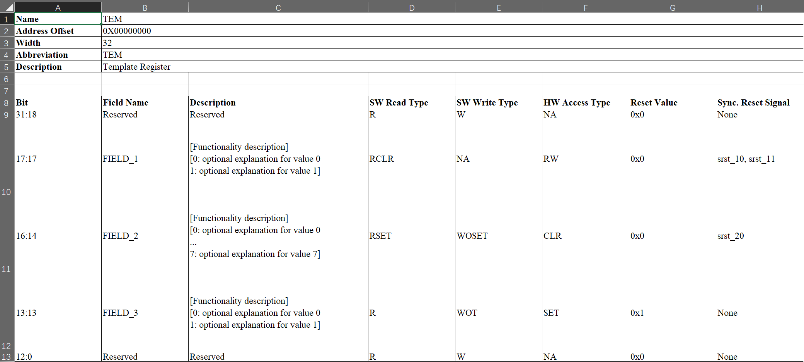

# **HJ-micro Register Design Automation Tool (HRDA Tool)**

## **1. Introduction**

HRDA Tool is a command-line register automation tool developed by Python, which can be divided into two major parts: front-end and back-end. The front-end comprises template generation which supports for generating register description templates in Excel worksheet (.xlsx) format, and Parser which can parse the input Excel Worksheet or SystemRDL (.rdl) descriptions with semantic and predefined rule check. The back-end comprises generator abilities supporting for generating register RTL (Verilog/SystemVerilog) Modules, HTML documents, UVM RAL models and C header files.

## **2. Feature Description**

The overall implementation flow of the tool is shown in the figure below.


### **2.1 Register Template Generator (Excel Format)**

The basic format of the Excel template is shown in the two figures below.




The above figure shows the basic format of a single register. The designer can refer to the template to edit and extend it, and arrange several tables corresponding to  more than one registers in a worksheet, with blank lines separating each table.

The defined register elements are as follows.

- Register Name: consistent with the `name` attribute in SystemRDL. It is used to help understand register functionality which will be shown on HTML documents.

- Address Offset: each Excel worksheet is mapped to an `addrmap` component in SystemRDL and has a independent base address. Therefore, the address offset value filled in by the designer is based on the current worksheet's base address. It is recommended to start addressing from `0X0`.

- Register Bitwidth: currently only `32 bit` or `64 bit` is supported. If 32-bit bus interface is used to connected to the whole system, the snapshot feature will be implemented in 64-bit registers.

- Register Abbreviation

- Register Description: consistent with the `desc` attribute in the SystemRDL. It is used to help understand register functionality which will be shown on HTML documents.

- Field Definition

  - Bit Range: indicates the location of the field in the form of `xx:xx`.

  - Field Name: corresponds to the field instance name of the generated RTL, also consistent with the `name` attribute in SystemRDL.

  - Field Description: consistent with the `desc` attribute in SystemRDL.

  - Read Attribute (Read Type): consistent with the `onread` attribute in SystemRDL. `R`, `RCLR` and `RSET` are supported.

  - Write Attribute (Write Type): consistent with the `onwrite` attribute in SystemRDL. `W`, `WOC`, `WOS`, `WOT`, `WZC`, `WZS`, `WZT` are supported.

  - Reset value: field reset value for synchronous and generic asynchronous reset signals.

  - Synchronous Reset Signals: In addition to the generic asynchronous reset by default, declaration of independent, one or more synchronous reset signals are supported.

### **2.2 Excel Parser**

The Excel parser check all Excel files provided by the designer, including basic format and design rules, and then converts the parsed register specification model into SystemRDL code, which will be submitted to the `SystemRDL Compiler` later. Intermediate SystemRDL code generation also allows the designer to add more complicated features supported by SystemRDL.

Rules to be checked:

- **BASIC_FORMAT :** Basic format constrained by regular expressions.

  1. the base address must be hexdecimal and prefixed with `0X(x)`

  2. the address offset must be hexdecimal and prefixed with `0X(x)`

  3. the register bitwidth can only be `32 bit` or `64 bit`.

  4. supported field read and write attributes: `R`, `RCLR`, `RSET`, `W`, `WOC`, `WOS`, `WOT`, `WZC`, `WZS`, `WZT`

  5. field bit range is in `xx:xx` format

  6. the reset value is hexdecimal and prefixed with `0X(x)`

  7. field synchronous reset signals is `None` if there is none, or there can be one or more, separated by `,` in the case of more than one

- **REG_ADDR :** Legality of the assignment of register address offsets.

  1. address offset is by integral times of the register byte length (called `regalign` method in SystemRDL)

  2. no address overlap is allowed in the same Excel worksheet

- **FIELD_DEFINITION :** Legality of field definitions.

  1. the bit order of multiple fields should be arranged from high to low

  2. the bit range of each field should be arranged in `[high_bit]:[low_bit]` order

  3. field bit range no overlap (3.1), and no omission (3.2)

  4. the reset value cannot exceed the maximum value which field can represent

  5. no duplicate field name except for `Reserved`

  6. the synchronous reset signal of the `Reserved` field should be `None`.

  7. no duplicate synchronous reset signal name in one field.

If any of above rules are not met during parse and check, Excel parser will raise error and error message will show the position where error occurs.

### **2.3 SystemRDL Compiler**

SystemRDL parse relies on an open-source project `SystemRDL Compiler`, see the link in section 3.1 for detailed information. SystemRDL Compiler is able to parse, compile and check RDL input files followed by SystemRDL 2.0 Spec to generate a traversable hierarchical register model, with the basic workflow shown in the following diagram.


Simple example:

```systemrdl
reg my_reg_t {
    field {} f1;
    field {} f2;
};

addrmap top {
    my_reg_t A[4];
    my_reg_t B;
};
```

Once compiled, the register model is like this:


or another `Node` overlay:


The model bridges the front-end and the back-end of this tool. The front-end parser ultimately generates this model, and everything on the back-end is based on this model as input.

> For a detailed description of this model, see SystemRDL Compiler Documentation : [https://systemrdl-compiler.readthedocs.io/en/stable/index.html](https://systemrdl-compiler.readthedocs.io/en/stable/index.html)

### **2.4 RTL Generator**

See HRDA Tool Technical Reference Manual.

### **2.5 HTML Generator**

The HTML generator relies on the open-source project `PeakRDL-html`, see the link in section 3.1 for detailed information. A simple example of exported HTML is shown below.


### **2.6 UVM RAL Generator**

The export of the UVM register model relies on the open-source project `PeakRDL-uvm`, see the link in section 3.1 for detailed information.

### **2.7 C Header Generator (TBD)**

## **3. Usage Notes**

### **3.1 Environment and dependencies**

- Available OS: Windows/Linux

- Python Version 3.7+

  - systemrdl-compiler [https://github.com/SystemRDL/systemrdl-compiler](https://github.com/SystemRDL/systemrdl-compiler)

  - PeakRDL-html [https://github.com/SystemRDL/PeakRDL-html](https://github.com/SystemRDL/PeakRDL-html)

  - PeakRDL-uvm [https://github.com/SystemRDL/PeakRDL-uvm](https://github.com/SystemRDL/PeakRDL-uvm)

### **3.2 Command options and arguments**

- `-h,--help`

  Show help information.

  

- `-v, --version`

  Show `RDA Tool` version.

- `excel_template`

  Subcommand to generate register specification templates in Excel worksheet (.xlsx) format with the following command options.

  `-h, --help`

  Show help information for this subcommand.

  

  `-d,--dir [DIR]`

  Specify the location of the directory where the template will be generated, the default is the current directory.

  `-n,--name [NAME]`

  Specify the file name of the generated template, if there is a duplicate name, it will be automatically distinguished by a number, the default is `template.xlsx`.

  `-rnum [RNUM]`

  Specify the number of registers to be included in the generated template, default is `1`.

  `-rname [TEM1 TEM2 ...]`

  Specify the name of the register in the generated template, the default is `TEM`, the default name and abbreviation are the same.

  `-l, --language [cn | en]`

  Specify the language format of the generated template: `cn/en`, default is `cn`.

- `parse`

  Sub-command to check the syntax and rules of the input Excel(.xlsx) and SystemRDL(.rdl) files, and compile them into the hierarchical model defined in `systemrdl-compiler`, with the following command options.

  `-h, --help`

  Show help information for this subcommand.

  

  `-f, --file [FILE1 FILE2 ...]`

  Specify the input Excel(.xlsx)/SystemRDL(.rdl) files, support multiple, mixed input files at the same time, error will be reported if any of input files do not exist.

  `-l, --list [LIST_FILE]`

  Specify a text-based file list including all files to be read. Parser will read and parse files in order, if the file list or any file in it does not exist, an error will be reported.

  > The `-f, --file` or `-l, --list` options must be used but not at the same time. If so, warning message will be reported and parser will ignore the `-l, --list` option.

  `-g, --generate`

  Explicitly specifying this option parses and converts all input Excel (.xlsx) files to SystemRDL (.rdl) files one by one, with separate `addrmap` for each Excel worksheet. When the input is all Excel (.xlsx) files, parser generates an additional SystemRDL (.rdl) file containing the top-level `addrmap`, which instantiates all child `addrmaps`.

  If this option is not used, Parser will only conduct rule check and parse, thus no additional files will be generated.

  `-m, --module [MODULE_NAME]`

  If `-g, --generate` option is specified, this option specifies top-level `addrmap` name and top-level RDL file name to be generated for subsequent analysis and further modification. See detailed information in Chapter 2.4: RTL generator.

  `-gdir, --gen_dir [GEN_DIR]`

  When using the `-g, --generate` option, this option specifies the directory where the files are generated, the default is the current directory.

- `generate`

  subcommand for generating RTL Module, HTML Docs, UVM RAL, C Header Files, with the following command options.

  `-h, --help`

  Show help information for this subcommand.

  

  `-f, --file [FILE1 FILE2 ...]`

  Specify the input Excel(.xlsx)/SystemRDL(.rdl) files, support multiple, mixed input files at the same time, error will be reported if any of input files do not exist.

  `-l, --list [LIST_FILE]`

  Specify a text-based file list including all files to be read. Parser will read and parse files in order, if the file list or any file in it does not exist, an error will be reported.

  > The `-f, --file` or `-l, --list` options must be used but not at the same time. If so, warning message will be reported and parser will ignore the `-l, --list` option.

  `-m, --module [MODULE_NAME]`

  Used for the situation where all input files are Excel worksheets. Like `-m` option in `parse` sub-command, this option specifies top-level `addrmap` name and top-level RDL file name to be generated for subsequent analysis and further modification. See detailed information in Chapter 2.4: RTL generator.

  `-gdir, --gen_dir [dir]`

  Specify the directory where the generated files will be stored. If the directory does not exist, an error will be reported. Default is the current directory.

  `-grtl, --gen_rtl`

  Specify this option explicitly to generate RTL Module code.

  `-ghtml, --gen_html`

  Specify this option explicitly to generate the register description in HTML format.

  `-gral, --gen_ral`

  Specify this option explicitly to generate the UVM RAL verification model.

  `-gch,--gen_cheader`

  Specifying this option explicitly generates the register C header file.

  `-gall,--gen_all`

  Specifying this option explicitly generates all of the above files.

### **3.3 Example**

> Switch to the source directory of the tool, or add the executable `hrda` to `PATH`, or use the `module` tool for configuration.

- Generate the register template in Excel format.

  ```bash
  mkdir test
  hrda excel_template -n test.xlsx -rnum 3 -rname tem1 tem2 tem3
  ```

- Parse the register description in Excel format and generate the corresponding RDL file.

  ```bash
  hrda parse -f test/test.xlsx -g -gdir . /test -m test_top
  # another method: edit and save a list file
  hrda parse -l test.list -g -gdir . /test -m test_top
  ```

- Generate using Generator

  ```bash
  hrda generate -f test.xlsx -gdir . /test -grtl -ghtml -gral -gch
  # another method: edit and save a list file
  hrda generate -l test.list -gdir . /test -gall
  ```

> If execution of `hrda` fails, check that `hrda` is in `PATH` and that the Python version and dependencies mentioned in section 3.1 are satisfied.
