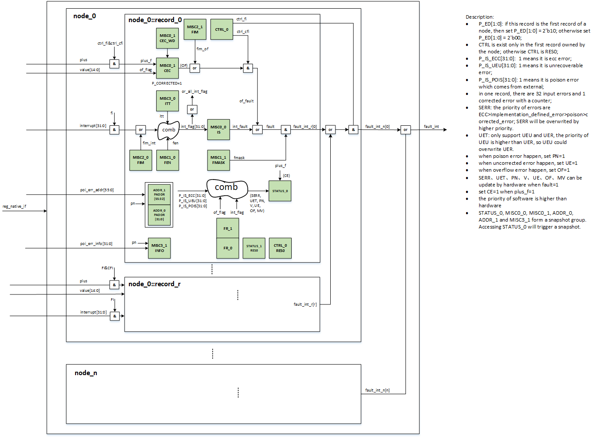
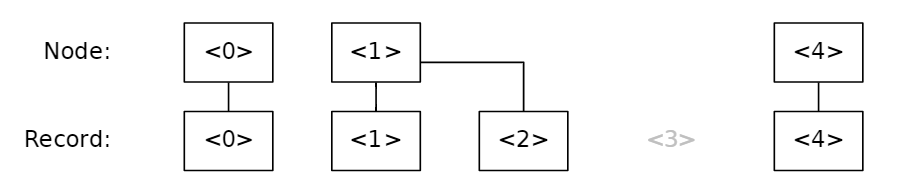

# **RAS IP Block Generation and Integration Guide**

## **IP Generation**

The RAS IP block generation is integrated in HRDA.

Step 1, generate a SystemRDL file for RAS using `hrda template`.

```bash
# generate a SystemRDL template for RAS,
# you just need to specify the record number of each node
# e.g. --ras_record_list 1 2 3 for 3 nodes with 1, 2, 3 records respectively
hrda template -rdl --ras_template --ras_record_list <record-number-list> -n <template-name>
```

In the generated template SystemRDL file, you can add implementation-specified description to nodes, records and registers based on your own usage.

Step 2, generate Verilog RTL using `hrda generate`.

```bash
# generate RTL using the template
hrda generate -f <template-name>.rdl -grtl -gdir <output-directory>
```

## **Architecture**

All nodes and records are in one `regslv` module as shown below.



Additionally, the record ID does not start from 0 in a new node but is given a global ID in the RAS IP block as shown below.



There are 1 corrected error counter and 32 uncorrected error interrupt for each record. See RAS IP block specification for more details.

## **Port Definition**

- `reg_native_if`

    register native interface connecting to the upstream `regdisp` module.

- `<node_name>_<record_name>__plus`

    input, 1 bit to indicate that the *corrected error* counter should be incremented in a record.

- `<node_name>_<record_name>__plus_value`

    input, 15 bits to indicate the value to be added to the *corrected error* counter in a record.

- `<node_name>_<record_name>__interrupt`

    input, 32-bit input uncorrected error interrupt signals for each record.

- `fault_int`

    output, 1-bit fault interrupt signal for the whole RAS IP block.

## **Parameterization**

Each record has a set of parameters to be configured by user.

- `<node_name>_<record_name>_P_IS_ECC`

    32 bit, with each bit indicating whether the corresponding `<node_name>_<record_name>__interrupt` signal is 2-bit uncorrected ECC error or not.

- `<node_name>_<record_name>_P_IS_UEU`

    32 bit, with each bit indicating whether the corresponding `<node_name>_<record_name>__interrupt` signal is unrecoverable error or not.

- `<node_name>_<record_name>_P_IS_POIS`

    32 bit, with each bit indicating whether the corresponding `<node_name>_<record_name>__interrupt` signal is poison error or not.

Users can only set one of the three parameters to 1 in the same bit position for each record.

If neither of `P_IS_ECC`, `P_IS_UEU` and `P_IS_POIS` is set in the same bit position in a record, the corresponding `<node_name>_<record_name>__interrupt` signal is treated as *IMPLEMENTATION DEFINED*.

--------------------

**Note:**

1. *IMPLEMENTATION DEFINED* error will be treated as uncorrected and recoverable error (UER).

2. Poison error is a special type of uncorrected error.

--------------------
